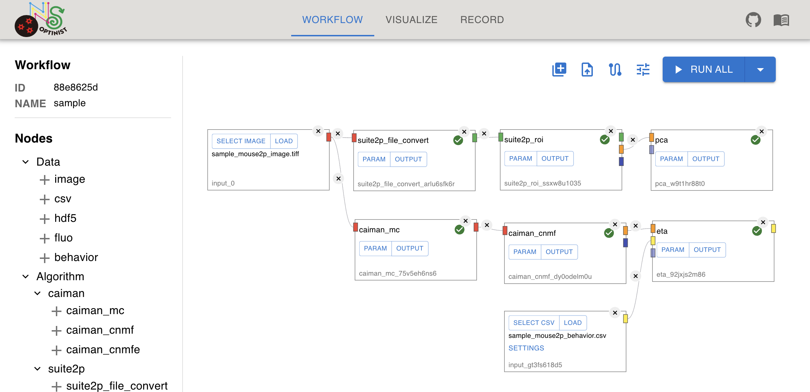
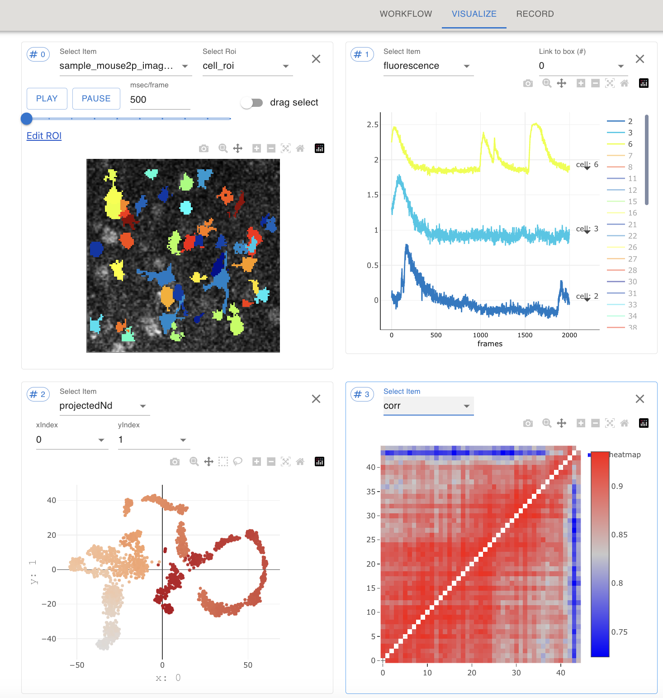
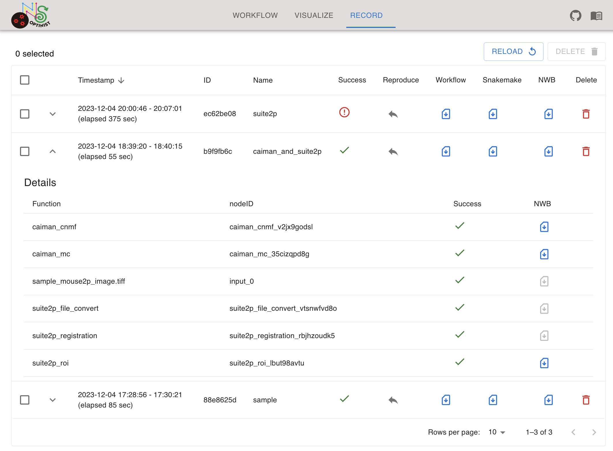

# optinist 

<p align="center">
    <a>
       
    </a>
    <a>
      
    </a>
    <a href="https://pypi.org/project/optinist">
        
    </a>
    <a href="https://pypi.org/project/optinist">
        
    </a>
    <a href="https://pypi.org/project/optinist">
      
    </a>
    <a href="https://github.com/oist/optinist">
      
    </a>
    <a href="https://github.com/oist/optinist">
      
    </a>
    <a href="https://github.com/oist/optinist">
      
    </a>
</p>

OptiNiSt(Optical Neuroimage Studio) is a GUI based workflow pipeline tools for processing two-photon calcium imaging data.

OptiNiSt helps researchers try multiple data analysis methods, visualize the results, and construct the data analysis pipelines easily and quickly on GUI. OptiNiSt's data-saving format follows NWB standards.

OptiNiSt also supports reproducibility of scientific research, standardization of analysis protocols, and developments of novel analysis tools as plug-in.

## Support library
### ROI detection
- [x] [Suite2p](https://github.com/MouseLand/suite2p)
- [x] [CaImAn](https://github.com/flatironinstitute/CaImAn)
- [x] [LCCD](https://github.com/magnetizedCell/lccd-python)

### Postprocessing
- [x] Basic Neural Analysis(Event Trigger Average...)
- [x] Dimenstion Reduction(PCA...)
- [x] Neural Decoding(LDA...)
- [x] Neural Population Analysis(Correlation...)

### Saving Format
- [x] [NWB](https://github.com/NeurodataWithoutBorders/pynwb)


## Key Features
### :beginner: Easy-To-Create Workflow
- **zero-knowledge of coding**: OptiNiSt allows you to create analysis pipelines easily on the GUI.

### :zap: Visualizing analysis results
- **quick visualization**: OptiNiSt supports you visualize the analysis results by plotly.

### :rocket: Managing Workflows
- **recording and reproducing**: OptiNiSt records and reproduces the workflow pipelines easily.


## Installation
Need anaconda or miniconda environment.
```
conda create -n optinist python=3.8
conda activate optinist
```

Install from pip.
```
pip install optinist
```

launch.
```
run_optinist
```

Open browser. http://localhost:8000

## Documentation
https://optinist.readthedocs.io/en/latest/


## Using GUI
### Workflow
- OptiNiSt allows you to make your analysis pipelines by graph style using nodes and edges on GUI. Parameters for each analysis are easily changeable. 
<p align="center">
  
</p>


### Visualize
- OptiNiSt allows you to visualize the analysis results with one click by plotly. It supports a variety of plotting styles.
<p align="center">
  
</p>

### Record
- OptiNiSt supports you in recording and reproducing workflow pipelines in an organized manner. 
<p align="center">
  
</p>


## Contributors
### Proposers
Kenji Doya, Yukako Yamane [OIST Neural Computation Unit](https://groups.oist.jp/ncu)

### Main Developers
[Shogo Akiyama](https://github.com/ShogoAkiyama), [Yoshifumi Takeshima](https://github.com/Yoshifumi14)

### Support Developers
[Tatsuya Tanabe](https://github.com/ttya16), [Yosuke Kaneko](https://github.com/toto-maru), [Syuya Saeki](https://github.com/hiiaka)


## References
[[Suite2p]](https://github.com/MouseLand/suite2p) Marius Pachitariu, Carsen Stringer, Mario Dipoppa, Sylvia Schröder, L. Federico Rossi, Henry Dalgleish, Matteo Carandini, Kenneth D. Harris. "Suite2p: beyond 10,000 neurons with standard two-photon microscopy". 2017  
[[CaImAn]](https://github.com/flatironinstitute/CaImAn) Andrea Giovannucci Is a corresponding author, Johannes Friedrich, Pat Gunn, Jérémie Kalfon, Brandon L Brown, Sue Ann Koay, Jiannis Taxidis, Farzaneh Najafi, Jeffrey L Gauthier, Pengcheng Zhou, Baljit S Khakh, David W Tank, Dmitri B Chklovskii, Eftychios A Pnevmatikakis. "CaImAn: An open source tool for scalable Calcium Imaging data Analysis". 2019  
[[LCCD]](https://github.com/magnetizedCell/lccd-python) Tsubasa Ito, Keisuke Ota, Kanako Ueno, Yasuhiro Oisi, Chie Matsubara, Kenta Kobayashi, Masamichi Ohkura, Junichi Nakai, Masanori Murayama, Toru Aonishi, "Low computational-cost cell detection method for calcium imaging data", 2022
[[PyNWB]](https://github.com/NeurodataWithoutBorders/pynwb) Oliver Rübel, Andrew Tritt, Ryan Ly, Benjamin K. Dichter, Satrajit Ghosh, Lawrence Niu, Ivan Soltesz, Karel Svoboda, Loren Frank, Kristofer E. Bouchard, "The Neurodata Without Borders ecosystem for neurophysiological data science", bioRxiv 2021.03.13.435173, March 15, 2021

<!-- ## Citing the Project
To cite this repository in publications:
```
@misc{OptiNiSt,
  author = {name},
  title = {title},
  year = {2022},
  publisher = {},
  journal = {},
  howpublished = {},
}
``` -->
