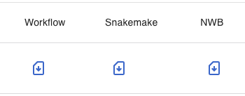

Record
=================
In the RECORD field, you can check the workflow status in your `OPTINIST_DIR` and manage your analysis pipeline. The table lists all the pipelines in your `OPTINIST_DIR`.

<br>
<p align="center">

</p>

### Record Table
In RECORD table, you can:
- See past executed workflows
- Reproduce past workflow
- Download files
    - Workflow config file
    - Snakemake config file
    - Results as NWB files
- Delete workflow record

<p align="center">

</p>

| Header | Description |
| --- | --- |
| Timestamp | Latest execution timestamp. <br>It shows start time, end time and elapsed time of the workflow. |
| ID | Workflow's unique id. <br>This is same as the directory name for the whole results of the workflow. |
| Name | User-defined workflow name. You can edit the name by clicking the name. |
| Success | Workflow's status. Success, error or running. |
| Reproduce | Button to reproduce the workflow to the WORKFLOW field. <br>You can visualize the results for the workflow by clicking the button. |
| Workflow | Button to download the workflow config yaml file. <br>This file can be used on import workflow button on WORKFLOW tab. <br>See details in [](ImportWorkflowYaml). |
| SnakeFile | Button to download the snakemake config file. |
| NWB | Button to download the analysis results as NWB file. |
| Delete | Button to delete the workflow record from the OPTINIST_DIR. |

### Details
You can check the results of each node by clicking arrow icon on the left of the table.

<p align="center">

</p>

| Header | Description |
| --- | --- |
| Function | Name of the node. |
| nodeID | Unique id of the node. <br>This is same as the directory name for the results of the node. <br> This id is shown on the each node's bottom. |
| Success | Node's status. Success, error or running. |
| NWB | Button to download the analysis results for the algorithm as NWB file. |

If status is error, you can see the error message by clicking status icon.

<p align="center">

</p>

(ReproduceButton)=
### Reproduce Button
Clicking the Reproduce arrow retrieves the pipeline onto the workflow.

This function is convenient when you want to check the results of the past workflow or reuse the same analysis pipeline.

<br>
<p align="left">

</p>

```{eval-rst}
.. note::
   You needed to RUN the reproduced workflow to visualize the results until version 1.1.0.
   From version 1.1.0, you can visualize the results without running the workflow.
```

### Download Buttons

<br>
<p align="left">

</p>

You can download 3 types of config files here.

| FileType | Description |
| --- | --- |
| Workflow | It includes the workflow and parameters information to reproduce in OptiNiSt GUI. <br>This file can be used on import workflow button on WORKFLOW tab. <br>See details in [](ImportWorkflowYaml). |
| SnakeFile | It includes the workflow and parameters information used by Snakemake. |
| NWB | NWBfile which contains the data and its analysis results. |
