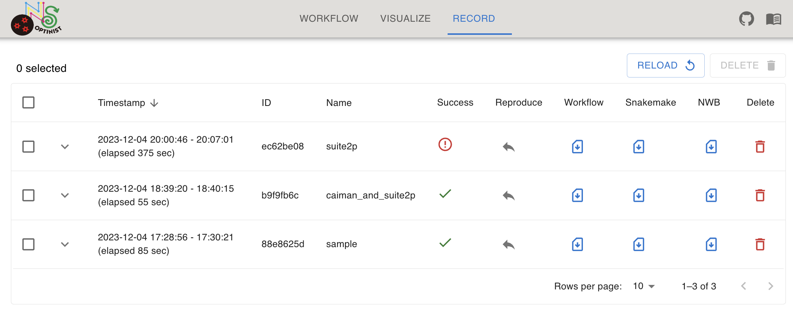
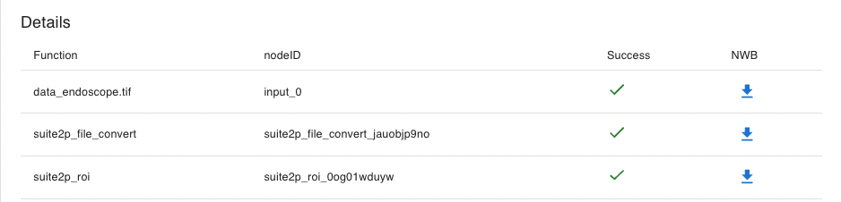

Record
=================

OptiNiSt records and reproduces past workflow pipelines. It can download results as nwb format.
 

Can
- Record past executing workflow
- Reproduce past workflow
- Download result as NWB
- Download snakemake config file

### Record Table
- **Timestamp**: last executing time.
- **ID**: Unique ID. Saving directory name.
- **Name**: workflow name, registered at executing.
- **Success**: executing is success or not.
- **Reproduce**: reproduce result to workflow.
- **SnakeFile**: Downalod snakemake config file.
- **NWB**: Downalod result as NWB file.
- **Delete**: Delete past workflow.

### Details
- **Function**: Executing function name.
- **nodeID**: Function unique ID.
- **Success**: executing is success or not.
- **NWB**: Downalod result as NWB file.

