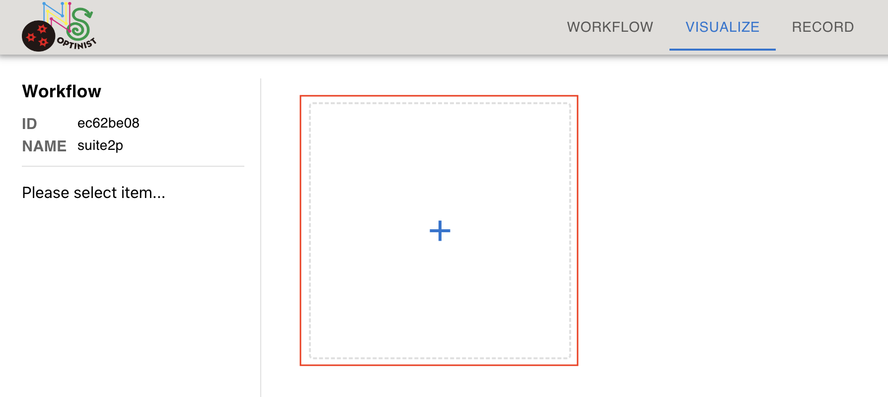
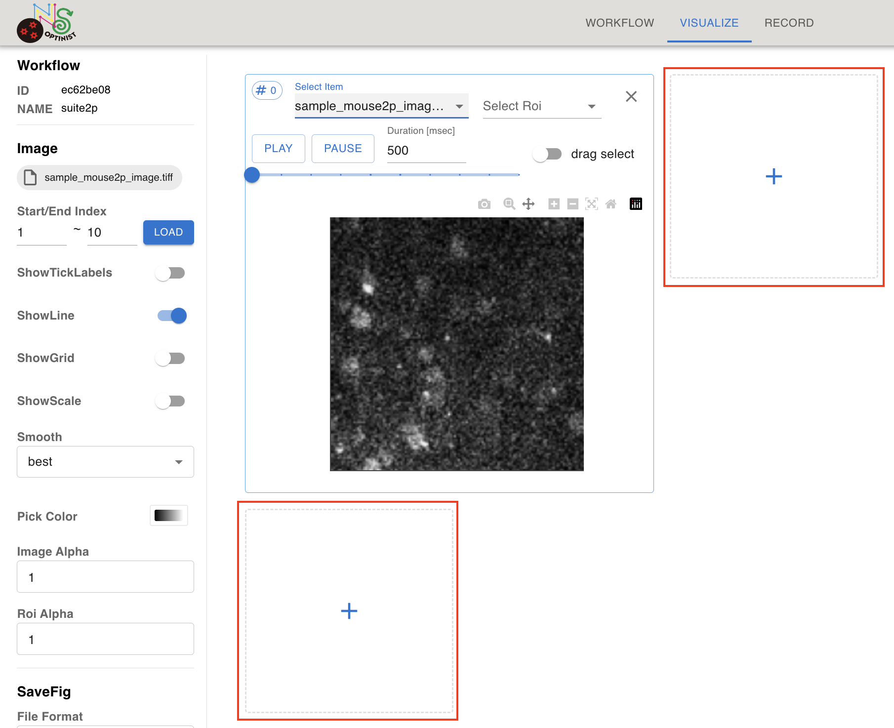
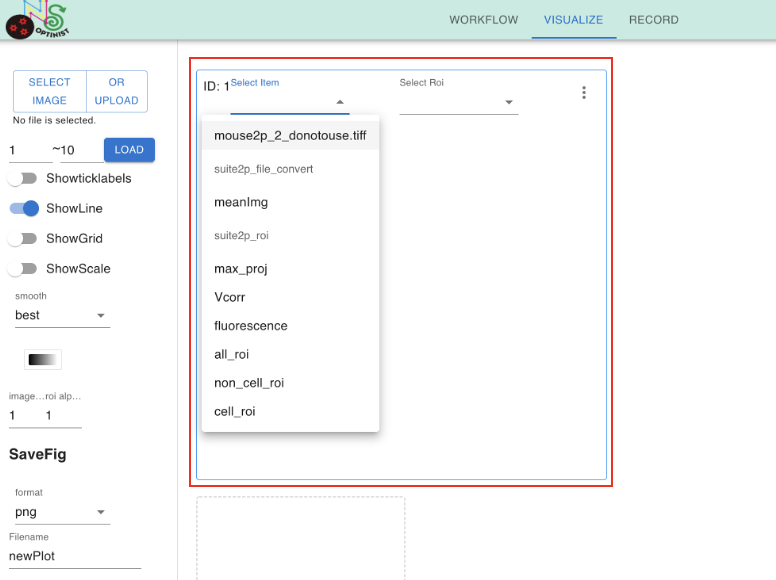
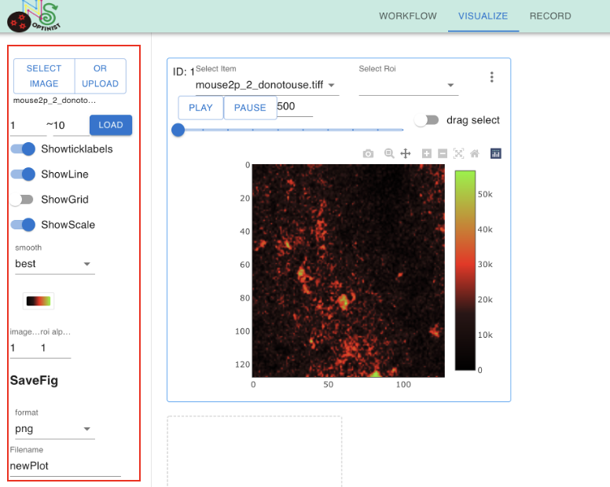
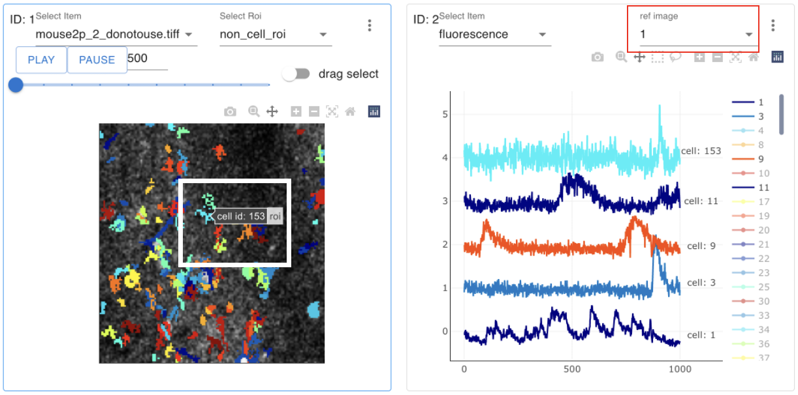

Visualize
=================

<p align="center">

</p>

OptiNiSt visualizes the analysis results by plotly. 


## Adding a display box

<p align="center">

</p>

Click the "+" button to create a display box.   
To add another display box below, click the "+" button shown below. 

<p align="center">

</p>

To add another display box to the right, click **︙** at the upper right side of the box and show the pulldown. Then, click `Insert into next columns`.

### Selecting an item to show

<p align="center">

</p>

Pull down of the `Select Item` shows the available item to show. Select one of these items.

### Checking movies

<p align="center">

</p>

You may want to check some frames of the multi-page tiff files. Visualize page offers the way to check. After creating a plot box by clicking on + mark, Select the image using the SELECT IMAGE button on the left top.
You can select the range of the frame by assigning 1st and last frame numbers. LOAD button starts loading the data.

<p align="center">

</p>

Click on the PLAY button within the plotting box to play the loaded movie.
The number indicated on the right of PAUSE button is the frame interval in milliseconds. 


### Customizing visualization parameters

<p align="center">

</p>

Select one of the display boxes by clicking inside of the box. The blue highlight of the box indicates the current selection of the display box. The parameters shown on the left are attached to the currently selected box. Details of the parameter are explained here.

## ROI and timecourse 
There is a way to link ROI plots and fluorescence time series. 
Create One box showing ROI and another box showing fluorescence. You can link two boxes by setting `ref image` in the fluorescence box to be the ID of the ROI box. (ID of the box is on the left upper side). By clicking on the ROI of a cell, you can visualize the corresponding fluorescence time course in the fluorescence box. By turning on the `drag select` in ROI box, you can select multiple cells in the image at once. 


## Ref Image

<p align="center">

</p>

TimeSeries plot can refer to a image plot to synthronize cell number index. Click or drag image plot so that cell number indexes are synthoronized in corresponding timeseries plot.


## Showing ROI and time courses
After running the ROI detection algorithms, the most often created plots are extracted cells' shape and fluorescence time series. To show the plot, prepare two plotting boxes.

<br>
<p align="center">

</p>

In one plotting box (ex, the one with ID:0), select a background image such as meanimg from the Select Item pulldowns.

<br>
<p align="center">

</p>

In the same plotting box, select cell_roi from the Select Roi pull-downs. Both Suite2P and CaImAn include the process to drop the extracted ROIs that do not meet the criteria. In OptiNiSt, the cell ID is given to all the ROIs. Cell_roi is the ROIs that passed the criteria. 

<br>
<p align="center">

</p>

The plotting box (ID:0) shows the background image and detected cells.
<br>
<p align="center">

</p>

In another plotting box (ex, the one with ID:1), select fluorescence from the Select Item pulldown.
And select 0(same ID with the plotting box of your ROI image) from the ref image pull down. By doing this,  the two plotting boxes are linked. 

<br>
<p align="center">

</p>

Now you can explore the ROI and time course. The color of ROI and corresponding time course is matched. You will know the cell ID by letting your mouse over the cell in the image. Clicking on the cell automatically adds the fluorescence time course of the clicked cell. 
<br>
<p align="center">

</p>

If it is tiring to select the cell by clicking one by one, turn on the drag select button on the right in the plotting box of ROI. It enables selecting all the cells within the rectangular area you define.

<br>
<p align="center">

</p>


## Editing ROI

<p align="center">

</p>

To the edit roi, prepare a plotting box. 

<p align="center">

</p>

In one plotting box (ex, the one with ID:0), select a background image such as meanImg from the Select Item pulldowns.
In the same plotting box, select cell_roi from the Select Roi pull-downs. 

<br>
<p align="center">

</p>
The plotting box (ID:0) shows the background image and detected cells.
<br>
<p align="center">

</p>

<p align="center">

</p>


You can click the <strong>Add ROI</strong> button then drag drop, resize the white cirle to change the new ROI position and size.
Press <strong>OK</strong> or <strong>Cancel</strong> button to Add or No

<p align="center">

</p>

Or click on each cell ROI to delete ROI or merge ROIs (when you select 2 or more ROI cells)
Press <strong>Merge ROI</strong> or <strong>Delete ROI</strong> or <strong>Cancel</strong> button to Merge or Delete or No.

NWB file is overwirtten with the ROI edit information.

```{eval-rst}
.. note::
  ROI edit information in NWB file

  - common

      - edited ROI ids are recorded in processing/optinist section

  - specific

      - merge

          - iscell data of ROIs to be merged changes to False
          - ROI after merge are added with new ID

      - delete

          - iscell data of deleted ROI changes to False.
```

```{eval-rst}
.. note::
  ROI's id and index of viewer have different values!

  - id

      - The id of ROI, **starting from 1**.
      - Shown in

          - VISUALIZE tab.
          - NWBfile's processing/optinist section.

  - index

      - Numbering of columns and rows in tables, **starting from 0**.
      - Shown in

          - table when you open NWBfile's timecourse data with viewers like `HDFView <https://www.hdfgroup.org/downloads/hdfview/>`_
```


## saving plots

<p align="center">

</p>

You can save created plots in svg, png, jpeg, or webp format. Please select the format, decide the saving name in the lower area on the left panel, and click the camera mark in the plotting box. Svg format saves the plot as a vector-based graphical format which may be convenient when you need high-resolution figures.

