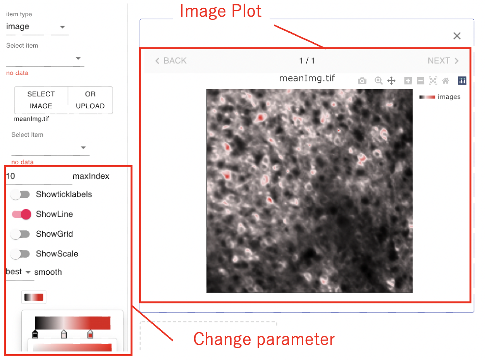
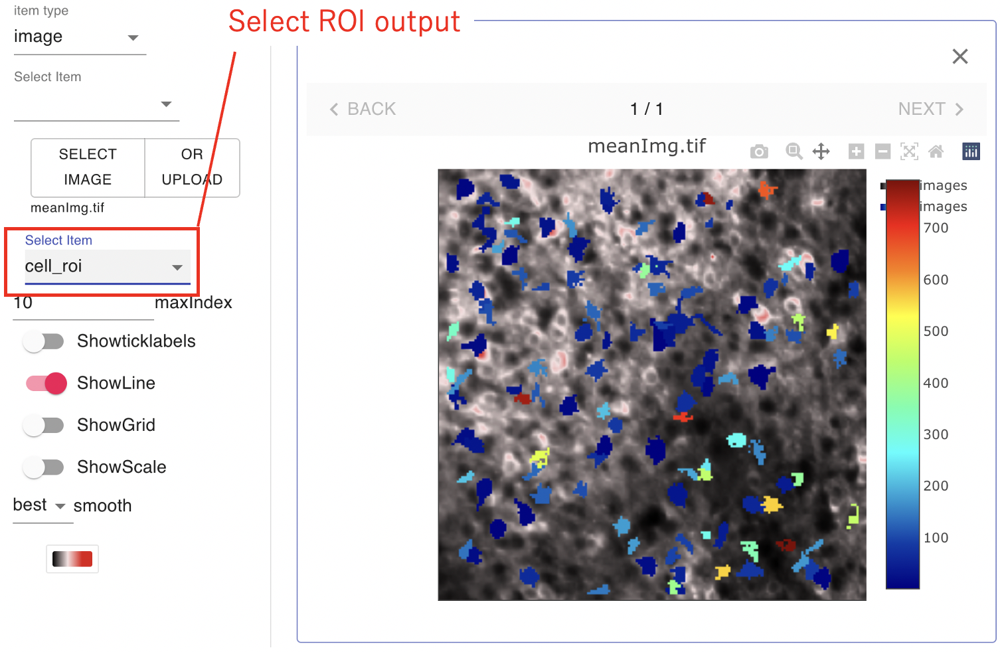
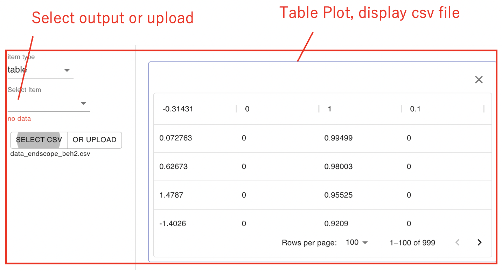
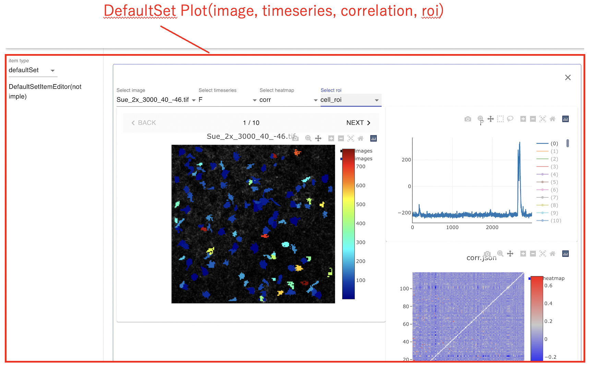

# Visualize Page
You can create and check outputs and other results in this page.  
First, click "+" button and add a display box.

Select data type(image, timeSeries ...).
With or without using flowchart pages, image and table plot can be uploaded in .tiff and .csv file, respectively.

Select output data.

 

## Image Plot
Image plot displays .tiff data. 
You can customize parameters such as line, axis and color.

If you get roi output, select and add roi plot.

 

## TimeSeries Plot
TimeSeries plot displays timeseries output.
Click legend number and add display data.
Offset enables to compare data more easily.

 

## Table Plot
Table plot displays csv data in table.  
("Customize parameter" is currently under development.)

## Multi Plot
The multiplot compares images, timeseries and heatmap output.  
("Synthronize cell number" and "customize parameter" are currently under development.)

