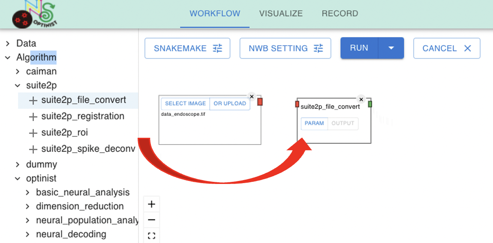
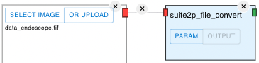

Workflow
=================

 

 
  
  - OptiNiSt makes it easy to create analysis pipelines using the GUI.
- In the workflow field, you can:
    - Select the data and the algorithms or analysis methods (nodes).
    - Connect these nodes to define the order of processing (pipelines).
- The analysis pipeline can be parallel or bifurcating.

## Creating workflow
### Setting Input data
  
  
 

 

By default, an Image node is displayed. This node defines the path to the data to use.
  
OptiNiSt uses `OPTINIST_DIR` for retrieving data and saving results. OptiNiSt searches for input data in the 'input' directory within `OPTINIST_DIR`. The default `OPTINIST_DIR` is `/tmp/optinist` on your computer.

Choosing a folder makes all the TIFF files in the shown sequence an input set of continuous frames.

You may not want to modify your original data folder, or you may want to make your data folder visible and accessible to OptiNiSt because imaging data can be large and take time to copy. You can take either strategy in assigning your data path:

1. **Copy your original data file to `OPTINIST_DIR` and assign the data path to the copied data.** To copy the data to `OPTINIST_DIR`, click on the UPLOAD button on the node. The UPLOAD button copies the selected file to your `OPTINIST_DIR/input`. This can be done from the GUI.

2. **Change the setting of `OPTINIST_DIR` by editing the `dir_path.py` file.** See [setting optinist directory](#setting-optinist_dir). The change is effective after relaunching.

Once the data is accessible, you can see it by clicking on the SELECT IMAGE button on the Image node. You can select a file or a folder here. Choosing a folder makes all the TIFF files in the shown sequence an input set of continuous frames.

Once the data is accessible, you can view it by following these steps:

1. Click on the SELECT IMAGE button on the Image node.
2. Select a file or a folder.

  
**Note:** Currently, image files with {.tif, .TIF, .tiff, .TIFF} extensions are accepted. Other extensions will be added on request.

### Adding Nodes
 

  

 

Select algorithms or analysis methods from the treeview on the left by clicking "+" button. 

The left side of the window displays all available analysis methods. Clicking on the + mark adds the analysis nodes to the Workflow field. ROI detection tools (currently Suite2P and CaImAn) are in the "Algorithm" category, and all other pre-installed analyses are in the "optinist" category.

Let's start with sample TIFF data (`mouse2p_2_long.tiff`) and try Suite2P ROI detection. 
First, you need to determine the image you will use. Select your image as explained [above](#assigning-input-data-path). 
Once it is selected, the name of the files is shown in the Image node.

### Parameter button and output button on the node

 

 

Each node has PARAM button and OUTPUT button. 

- **Editing Parameters:** Click on the PARAM button to view the parameters. You can edit them as needed. The names, types, and default values of the parameters are the same as the original algorithms. Refer to the original documentation to confirm the meaning of the parameters. The link list is available at [Implemented Analysis](https://optinist.readthedocs.io/en/latest/utils/implemented_analysis.html).

- **Checking Results:** The OUTPUT button is for a quick check of the results. The button becomes active after the successful execution of the pipeline. For details about the charts, see [Inspecting the Images and the Plots on Visualize](#inspecting-the-images-and-the-plots-on-visualize).

### Connecting Nodes 
Connect colored connectors of the nodes by dragging your cursor from the output connector to the next input connector to create connecting edges. The color of the connector indicates the data type of the input and the output.
You can only connect the input and output connectors of the same color. 

**DataType List**
- ImageData
- Suite2pData
- Fluorescence
- Behavior
- Iscell

 

 

### Removing Nodes 
Clicking on the x mark on a node or on an edge removes it from the workflow field. 

### Other Data Formats As The Input
Some of the analyses, such as event-triggered averaging or GLM need timecourse of behavioral data as an input. A behavior node is best for it.
The format should be .csv. Rows and columns can be specified by `settings` appearing after selecting the csv data. Note that the number of data points has to be the same as the number of frames of image data. 
Fluo data node is for cell's fluorescence timecourse data given as .csv. 

Another data format prepared is hdf5. This format is compatible with the nwb data format.
CSV and hdf5 nodes have black output connectors. The edge connected to the black output connector can be connected to any input connector. Be careful; this means that it does not check the format correspondence between input and output.

 

## Running pipelines
 

 

Click the RUN button at the top right to see two dropdown choices: RUNALL and RUN. 

- **RUNALL:**
    - Runs the entire process.
    - Assigns a new folder for saving the results.　This folder name is only for the user’s convenience. The actual folder name is long digit random letter+number. <!--Further information about the structure of the saved results is [here](https://optinist.readthedocs.io/en/latest/gui/record.html).)
-->

- **RUN:**
    - Skips already executed processes.
    - Checks for differences from the previous pipeline, including the existence of results and parameter changes.
    - If differences are detected, the downstream process is re-executed.
    - Results are overwritten in the existing folder.

- **Cancel:**
    - Abort the running pipeline immediately.

