Workflow
=================
OptiNiSt makes it easy to create analysis pipelines using the GUI.

In the workflow field, you can:
- Select the data and the algorithms or analysis methods (node).
- Connect these nodes to define the order of processing (workflow).

The analysis pipeline can be parallel or bifurcating.

<br>
<p align="center">

<br/>


## Creating workflow
You can create a new workflow by clicking the + button.

<br>
<p align="center">
  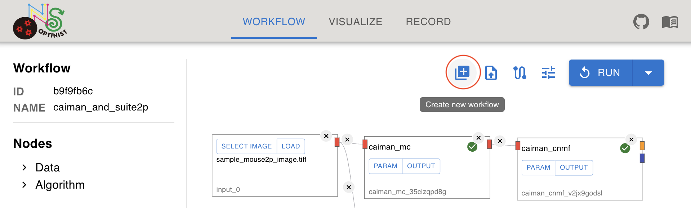
</p>
<br>

```{eval-rst}
.. caution::
   By creating workflow, current workflow will be deleted.

   The records are kept if you have already run the workflow. You can reproduce the workflow from RECORD tab. See details :ref:`here <ReproduceButton>`.
```


### Setting Input data
By default, an Image node is displayed. This node defines the path to the data to use.

<p align="center">
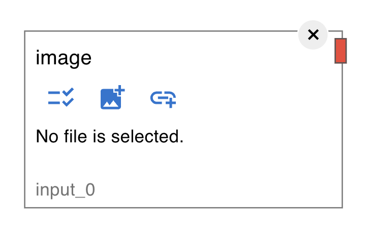
</p>
<br/>

To select the data, follow these steps:
1. Click on the check list icon on the Image node.
2. Select a file or a folder. Choosing a folder makes all the TIFF files in the shown sequence an input set of continuous frames.

You can select files in `input` directory under `OPTINIST_DIR`.
To put files there, see next [](DirectorySetting) section.

<p align="center">
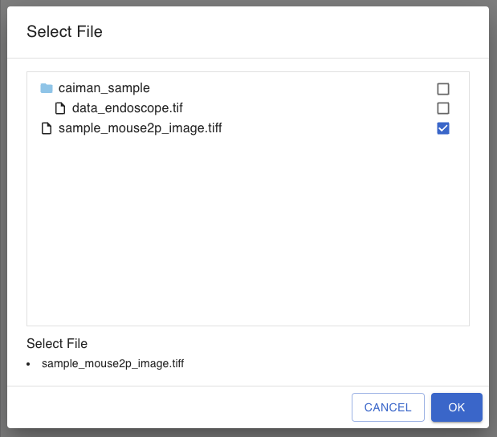
</p>
<br/>

The image's shapes are displayed in the file select dialog.
Algorithms for image analysis assumes (time, y, x) or (time, z, y, x).
Please check the data if you looks getting wrong results.

If you replace the image file with the same file name, shape cannot be updated automatically.
Please click reload icon besides the checkbox.

```{eval-rst}
.. note::
   Currently, only image files with {.tif, .TIF, .tiff, .TIFF} extensions are supported.
```

(DirectorySetting)=
#### Directory Setting
OptiNiSt uses `OPTINIST_DIR` for retrieving data and saving results. OptiNiSt searches for input data in the 'input' directory within `OPTINIST_DIR`. The default `OPTINIST_DIR` is `/tmp/studio` on your computer.

Choosing a folder makes all the TIFF files in the shown sequence an input set of continuous frames.

You may not want to modify your original data folder, or you may want to make your data folder visible and accessible to OptiNiSt because imaging data can be large and take time to copy. You can take either strategy in assigning your data path:

1. **Upload from GUI**

    Click on the image icon on the node. The LOAD button copies the selected file to your `OPTINIST_DIR/input`.

    <p align="center">
    
    </p>

    **By this method, you cannot upload multiple files or folder at once**.
    - If you want to upload multiple files or folder at once, use the next method.

2. **Copy files to `OPTINIST_DIR`**

    Copy your raw data to `OPTINIST_DIR/input/1/` by your OS's file manager or command lines.
      ```{eval-rst}
      .. warning::
          Be sure to copy under ``input/1/``. ``1`` is the default workspace id for :ref:`standalone mode <about-multiuser-mode>`.
          If you copy under ``input/`` directly, the file cannot be found from GUI.
      ```

    You can copy folder into the input directory.
    - If you put folder, you can see the folder from GUI, SELECT IMAGE dialog like this.
      <br>
      <p align="center">
      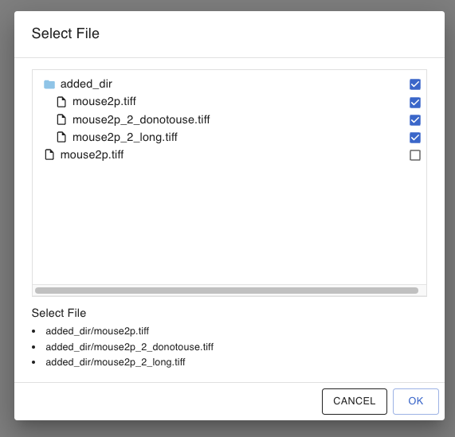
      </p>

3. **Get file via URL**

    Click on the link icon on the node.

    <p align="center">
    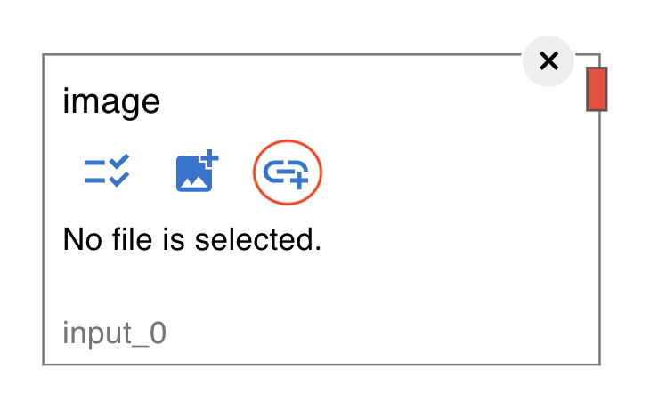
    </p>

    Then input dialog will be shown. You can input the URL of the file you want to use.

    <p align="center">
    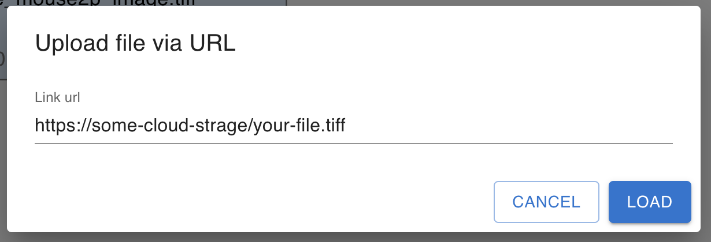
    </p>

    ```{eval-rst}
    .. note::
        The URL should be direct link to the one file.
        It should be

          - started with ``http://`` or ``https://``.
          - ended with the file name with extension.

        And more, download links require authentication are not supported.
    ```

4. **Change the setting of `OPTINIST_DIR`**

    This requires modifying source codes. See [](each-platforms-for-developer) installation guide section.
    `OPTINIST_DIR` is defined in `optinist/studio/app/dir_path.py`. Change line for `OPTINIST_DIR`, `INPUT_DIR`, and `OUTPUT_DIR` according to your demand. Changing `dir_path.py` may also be necessary when running the pipeline on your cluster computers. Also, you can quickly change `OPTINIST_DIR` by changing the environment variable before launching. The change is effective after relaunching.

#### Other Data Formats As The Input

* CSV, FLUO, BEHAVIOR

  These nodes are for csv data.
  Once the file selected, you can preview and change settings for the data.

  <p align="center">
  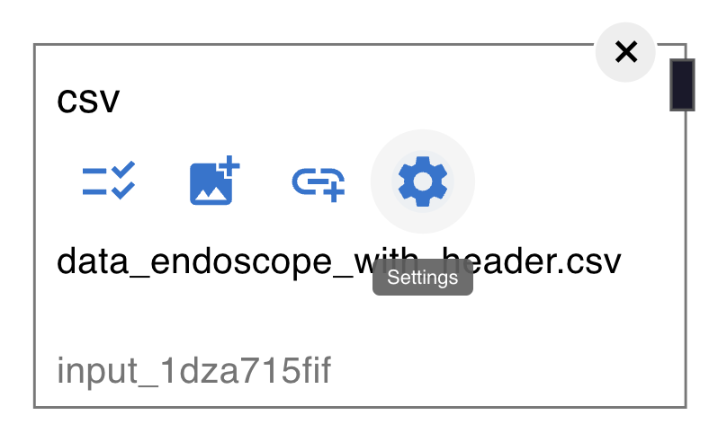
  </p>

  * transpose

    You can use transposed the data as the input by checking this box.

    <p align="center">
    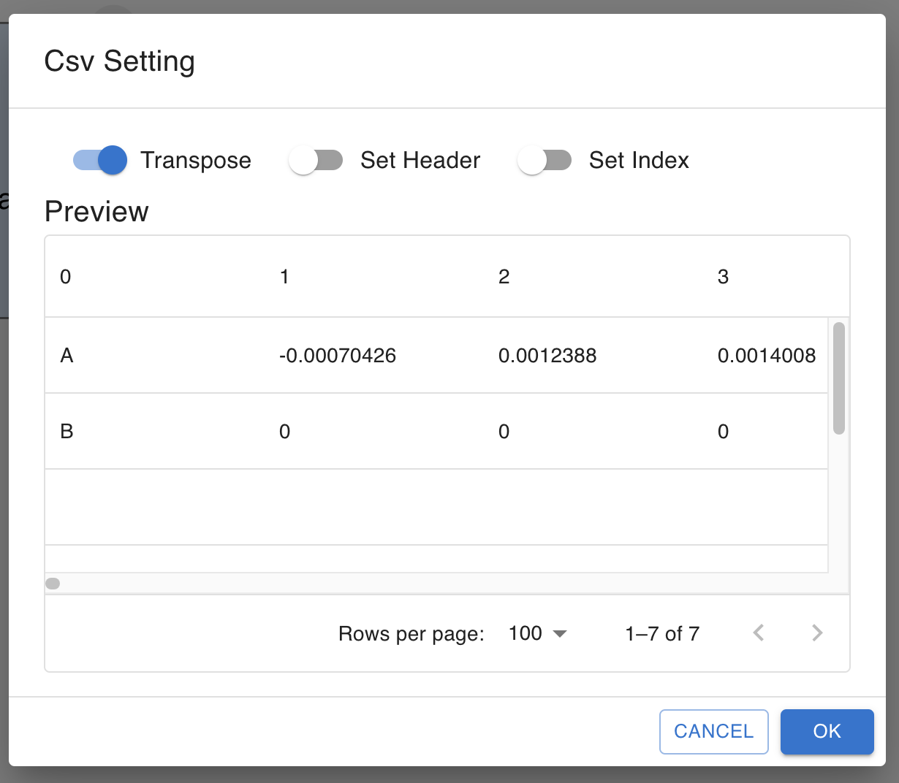
    </p>

    eta, cca, correlation, cross_correlation, granger, glm, lda, and svm assume the input neural data shape is frames x cells matrix.
    Because the output of CaImAn and Suite2P on the pipeline is cell x frames, the default setting for neural data for these analyses is set to transpose.

    Pca and tsne can be done in either direction depending on your purpose.
    The function assumes their input to be samples x features.

  * set_header

    If your csv data has header, check this box.
    Set the header index to your data's header row. (**first row is 0**)
    The data below the header row will be used as the data.

    <p align="center">
    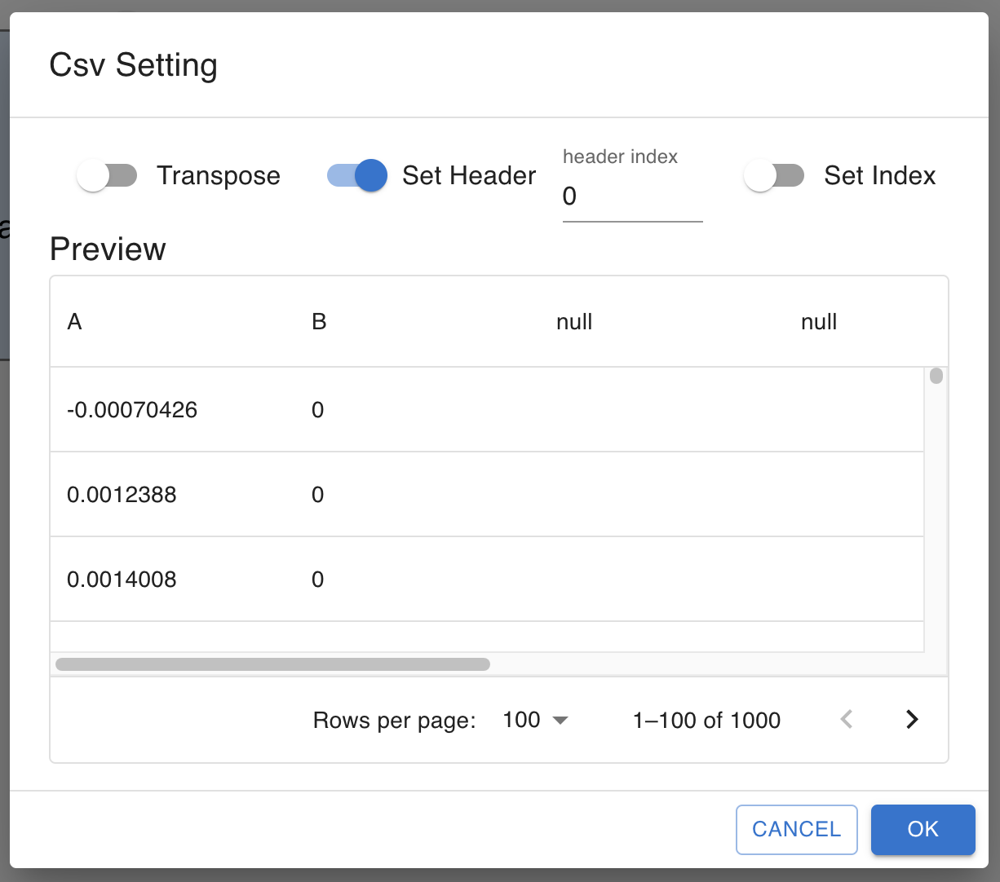
    </p>

  * set_index

    You can add index column to the data by checking this box.

    <p align="center">
    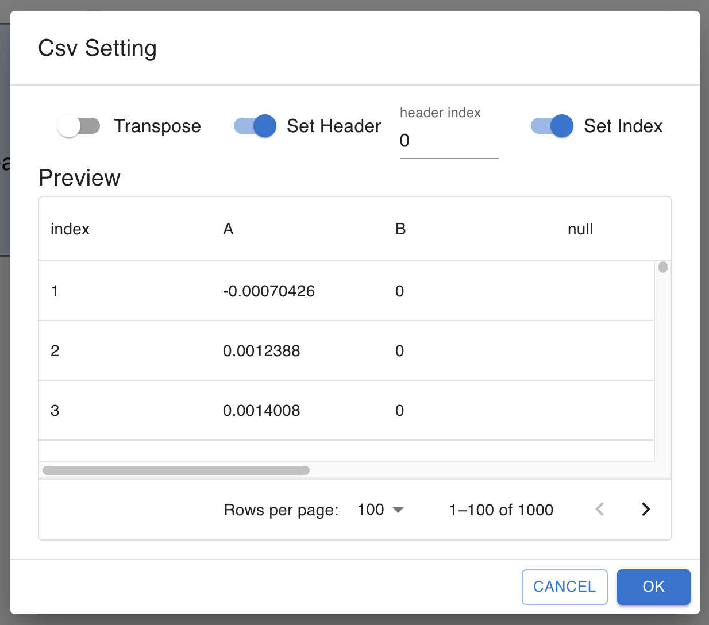
    </p>

* HDF5

  This node id for ``.hdf5`` and ``.nwb``. NWB is compatible with the HDF5 data format. So you can use your NWB result's data as the input.

  <p align="center">
  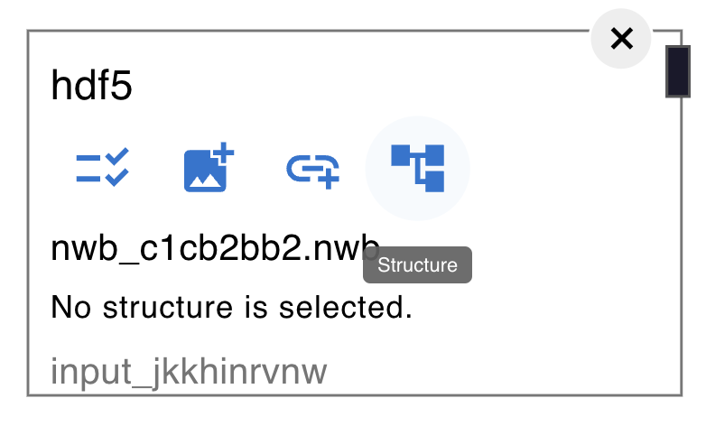
  </p>

  Once the file selected, you can dig into the data structure and select the data to use.

  <p align="center">
  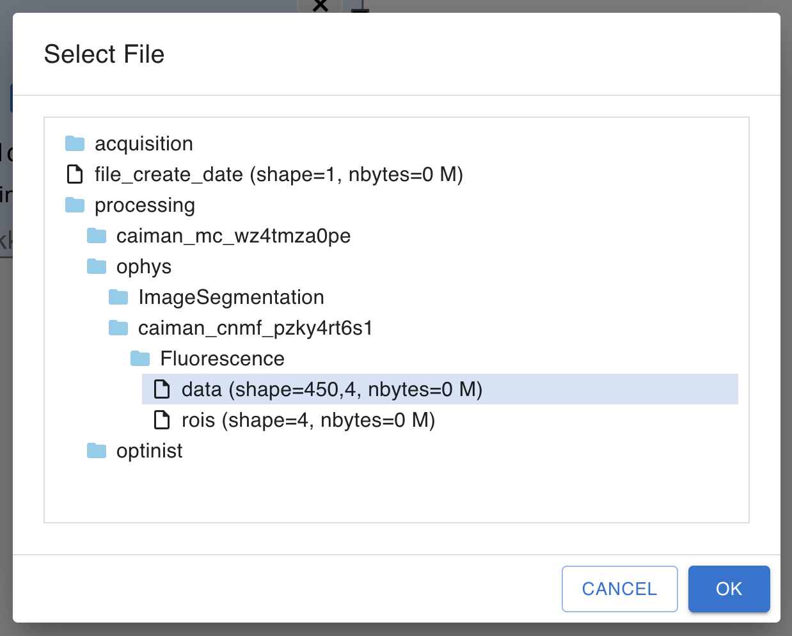
  </p>

  Connecting the hdf5 node to the pipeline, you can use the selected data in the hdf5 file.
  There are some utility algorithms for hdf5 data.
  fluo_from_hdf5 is to extract fluorescence data from hdf5 data.

  <p align="center">
  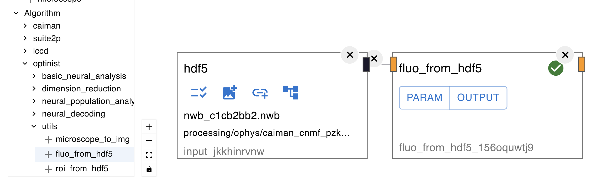
  </p>

* Matlab

  This node is for ``.mat`` file.
  Like hdf5 node, you can dig into the data structure and select the data to use.

```{eval-rst}
.. note::
  CSV, HDF5 and Matlab nodes have black output connectors.
  Black output connector can be connected to any input connector.
  Be careful; this means that it does not check the format correspondence between input and output.
```

* MICROSCOPE

  Currently, we've implemented to read following microscope data format.

  * Inscopix(.isxd)
  * NIKON(.nd2)
  * Olympus(.oir)

  ```{eval-rst}
  .. note::
     We use `py_isx <https://github.com/inscopix/py_isx>`_ package with version 1.0.* for Inscopix data.
     Currently, the library supports only CellSet and Movie file types, so you can use only them.
  ```

  ```{eval-rst}
  .. note::
     We implement loading C libraries for reading NIKON and Olympus file.
     The libraries are available only on Linux and Windows (Not on MacOS).

     - If you use Linux, use OptiNiSt by :ref:`developer mode <each-platforms-for-developer>`.
      - open ``studio/app/optinist/wrappers/optinist/conda/microscope.yaml`` and uncomment the ``- gcc=12`` line.
  ```

  <p align="center">
  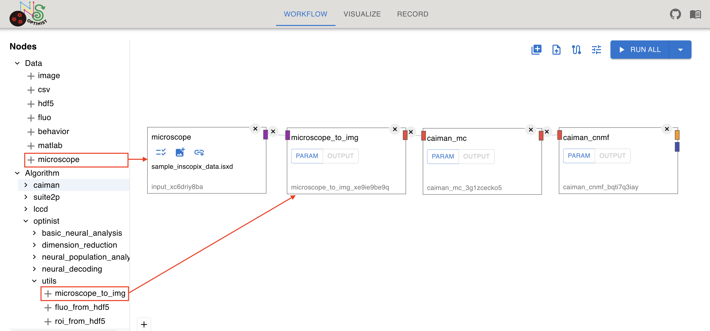
  </p>

  You can convert these data into ImageData so that you can use them in the pipeline.
  To convert, connect microscope_to_img Algorithm node to the microscope data node.


### Adding Nodes
Select Data or Algorithm node from the treeview on the left.
Clicking the + button adds the analysis nodes to the Workflow field.

<br>
<p align="center">
  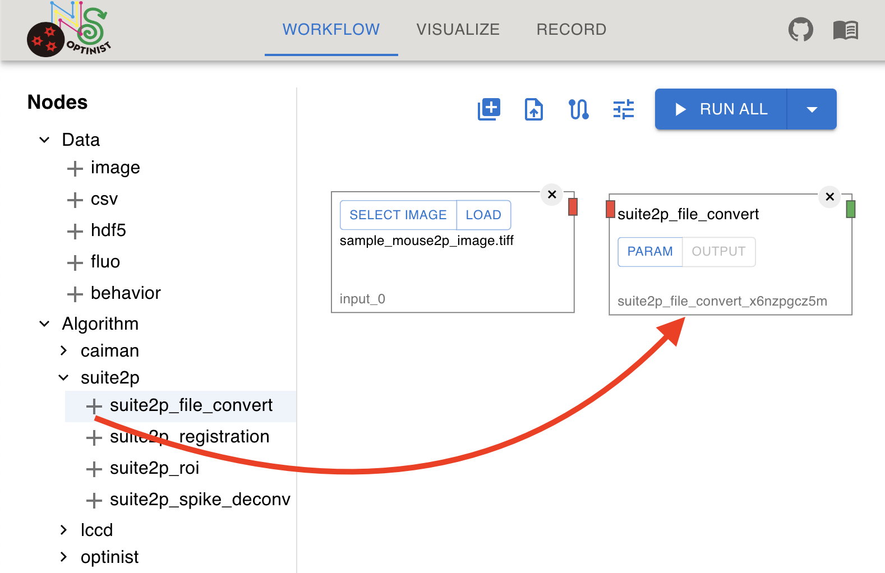
</p>
<br>

The left side of the window displays all available analysis methods. ROI detection tools (currently Suite2P, CaImAn and LCCD) are in the "Algorithm" category, and all other pre-installed analyses are in the "optinist" category.

### Algorithm Nodes

Each algorithm node has PARAM button and OUTPUT button.

<br>
<p align="center">
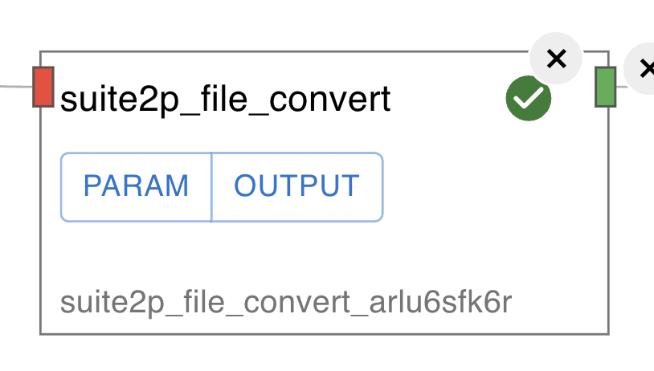
</p>
<br/>

- **PARAM**

  You can see or edit parameters for the algorithm.
  Clicking param button, the parameters are displayed in the right side of the window.

  <br>
  <p align="center">
  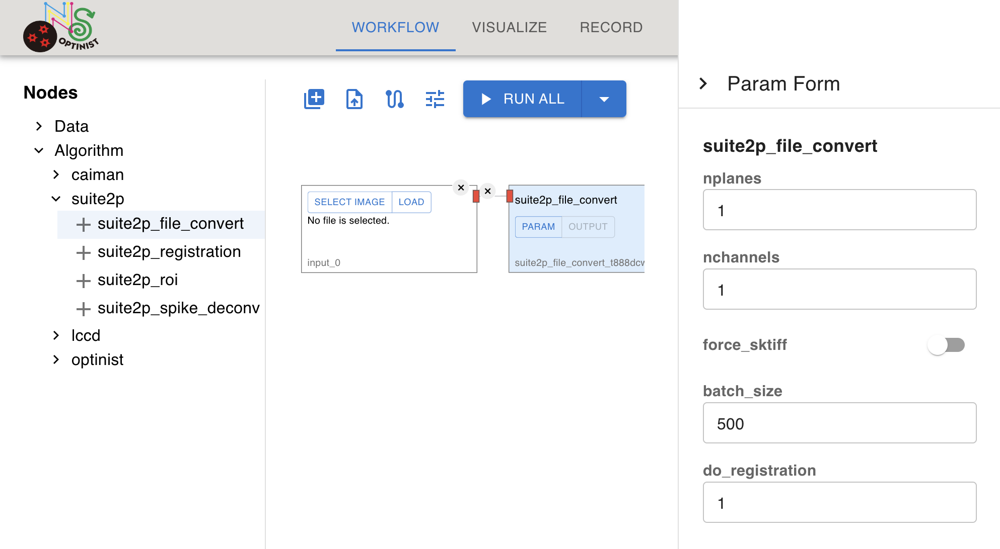
  </p>
  <br/>

  The names, types, and default values of the parameters are the same as the original algorithms. Refer to the original documentation to confirm the meaning of the parameters. The link list is available at [Implemented Analysis](https://optinist.readthedocs.io/en/latest/utils/implemented_analysis.html).

- **OUTPUT**

  You can check the results of algorithm quickly after the successful execution of the pipeline. For details about the charts, see [](Visualize).

  <br>
  <p align="center">
  
  </p>
  <br/>

(ConnectingNodes)=
### Connecting Nodes
Connect colored connectors of the nodes by dragging your cursor from the output connector(right side of the nodes) to the next input connector(left side of the nodes) to create connecting edges.

<br>
<p align="center">
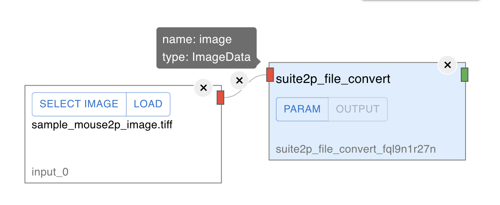
</p>
<br/>

The color of the connector indicates the data type of the input and the output.
You can only connect the input and output connectors of the same color.

**DataType List**
- <span style="color: red; ">ImageData</span>
- <span style="color: green; ">Suite2pData</span>
- <span style="color: orange; ">Fluorescence</span>
- <span style="color: #cfc22b; ">Behavior</span>
- <span style="color: blue; ">Iscell</span>


### Removing Nodes or Connects
Clicking on the x mark on a node or on an edge removes it from the workflow field.

(ImportWorkflowYaml)=
### Import existing workflow by yaml file
You can create same workflow by importing workflow config yaml format file. This feature is useful to share workflow template.

Workflow config file can be downloaded from RECORD tab's executed workflow.

<br>
<p align="center">
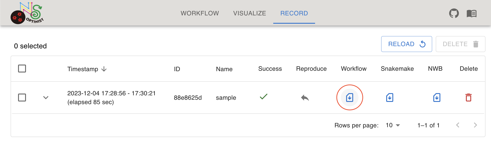
</p>
<br/>

Clicking the import icon button and select shared workflow config yaml.
Then you can create same workflow as the file's record.
Input file selection will not reproduced because it may not be in your device.

<br>
<p align="center">
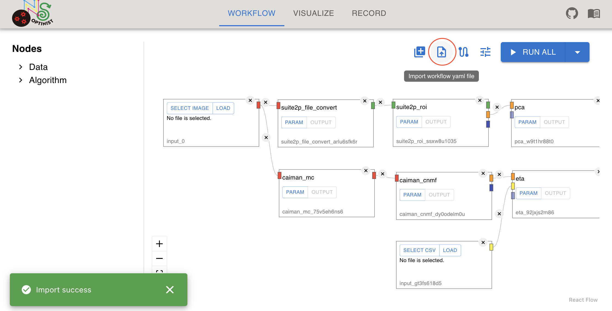
</p>
<br/>


## Running pipelines
Click the RUN button at the top right.

Note that while the workflow running, you **cannot**
- use [](Visualize) tab
- delete current workflow from [](Record) tab
- reproduce other workflow from [](Record) tab

There are 2 types of execution. You can select the type by clicking the dropdown button.

<br>
<p align="center">
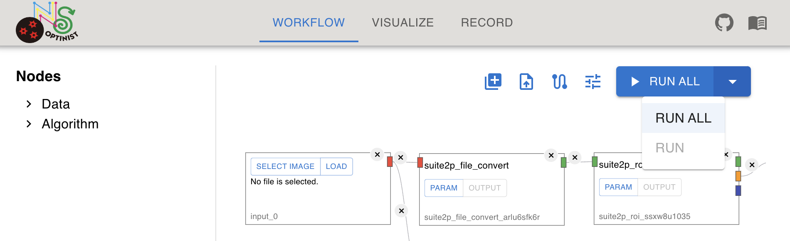
</p>
<br/>

### RUN ALL
- Runs the entire process.
- Assigns a new folder for saving the results. This folder name is only for the user’s convenience. The actual folder name is long digit random letter+number.

### RUN
- Available only when the pipeline has been executed.
- Useful to re-run the workflow with different parameters.
- By checking parameter changes and addition of new nodes, it would skip already executed processes.
  - e.g. Let's say you have executed following workflow.

    <br>
    <p align="left">
    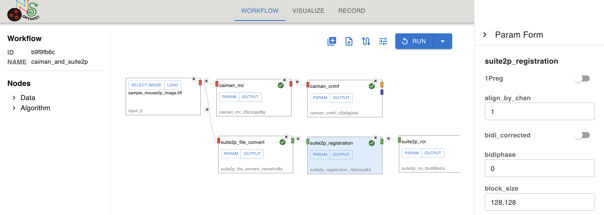
    </p>
    <br/>

    Then you have changed the parameter "block_size" of suite2p_registration from 128,128 to 256,256.
    With "RUN", only following nodes would be executed again.
    - suite2p_registration: because you have changed parameter for this node
    - suite2p_roi: because its upstream data (from suite2p_registration) would be changed.

    Nodes which would be executed by "RUN" are highlighted in yellow.

    <br>
    <p align="left">
    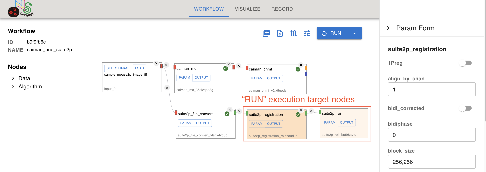
    </p>
    <br/>

  - Following changes would affect whole workflow. So you cannot use "RUN" button after changing them.
    - Input data
    - NWB settings

```{eval-rst}
.. caution::
   With RUN, results will be overwritten. To avoid this, use RUN ALL.
```

## SNAKEMANE settings
OptiNiSt's pipeline construction is based on [Snakemake](https://snakemake.readthedocs.io/en/stable/), a pipeline controlling tool for Python scripts.

<br>
<p align="center">
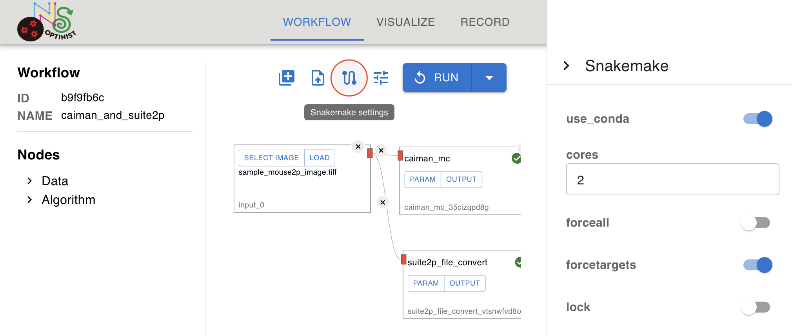
</p>
<br/>

The Snakemake parameter setting is following.
- use_conda: If this is on, snakemake uses conda environment.
- cores: Specifies the number of cores to use. If not specified, snakemake uses number of available cores in the machine.
- forceall: Flag to indicate the execution of the target regardless of already created output.
- forcetargets: Users may not want to change this.
- lock: Users may not want to change this.

For details about snakemake parameters please refer to [snakemake official page](https://snakemake.readthedocs.io/en/stable/executing/cli.html).


## NWB setting
Defines the metadata associated with the input data.
By configuring this, the output NWB file includes the information set here.
You can leave this setting as the default.

<br>
<p align="center">

</p>
<br/>

The details of NWB setting in OptiNiSt are following.

- session_description: a description of the session where this data was generated
- identifier: a unique text identifier for the file
- experiment_description: general description of the experiment
- device: device used to acquire the data (information such as manufacturer, firmware version, model etc.)
- optical_channel: information about the optical channel used to acquire the data
- imaging_plane: information about imaging such as sampling rate, excitation wave length, calcium indicator.
- image_serises: information about imaing time
- ophys: general information about imaging

For general information about NWB, refer to [NWB official page](https://www.nwb.org/getting-started/).

```{eval-rst}
.. note::
   Basically, these parameters are description for your experiment.
   So, they are not used for analysis except for following parameters.

   - ``imaging_plane.imaging_rate``
      This will be used as parameter for frame rate.
      See details in :ref:`Switch time course plot units <SwitchTimeUnit>`.

   - ``image_series.save_raw_image_to_nwb``
      If True, raw image data will be saved to NWB file's acquisition.
      If not, only the path to the image data will be saved.
```
