(Visualize)=
Visualize
=================
OptiNiSt visualizes the analysis results by [plotly](https://plotly.com/).

<p align="center">

</p>

## Adding a Display Box
Click the "+" button to create a display box.

<p align="center">

</p>

To add another display box , click the "+" button. You can add new boxes to the next row or the next column.

<p align="center">

</p>

### Selecting an Item to Show
Pull down of the `Select Item` shows the available item to show. Select one of these items.

Items are separated by the data / algorithm nodes used to create them.

<p align="center">
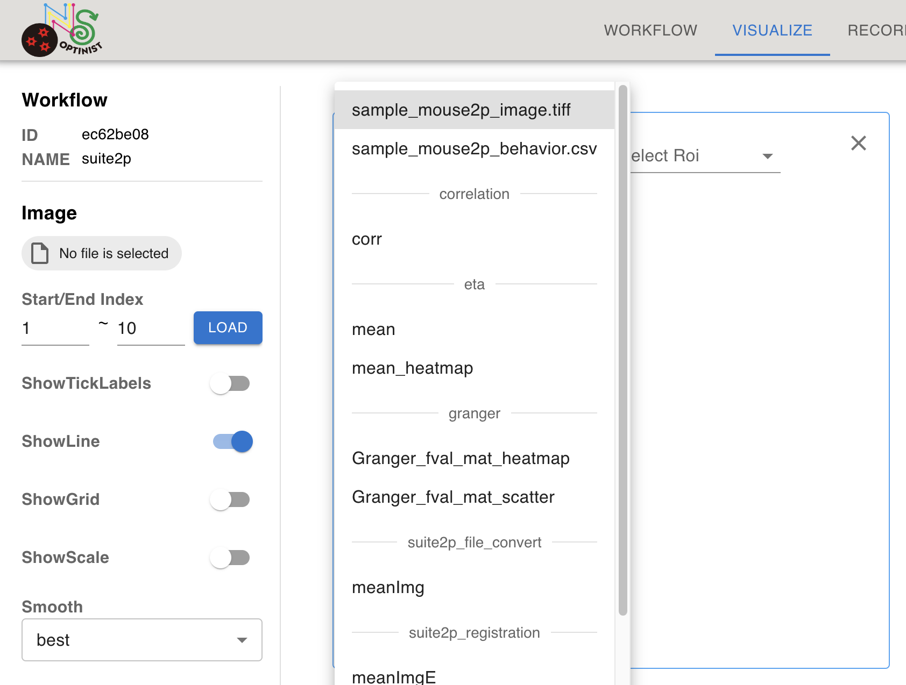
</p>


### Checking Movies
You may want to check some frames of the multi-page tiff files. Visualize page offers the way to check.

After creating a plot box by clicking on + mark, Select the image using the `Select Item` dropdown list.

You can select the range of the frames using the Start/End Index in the left sidebar. Input the first and last frame numbers, then click the LOAD button.

<p align="center">
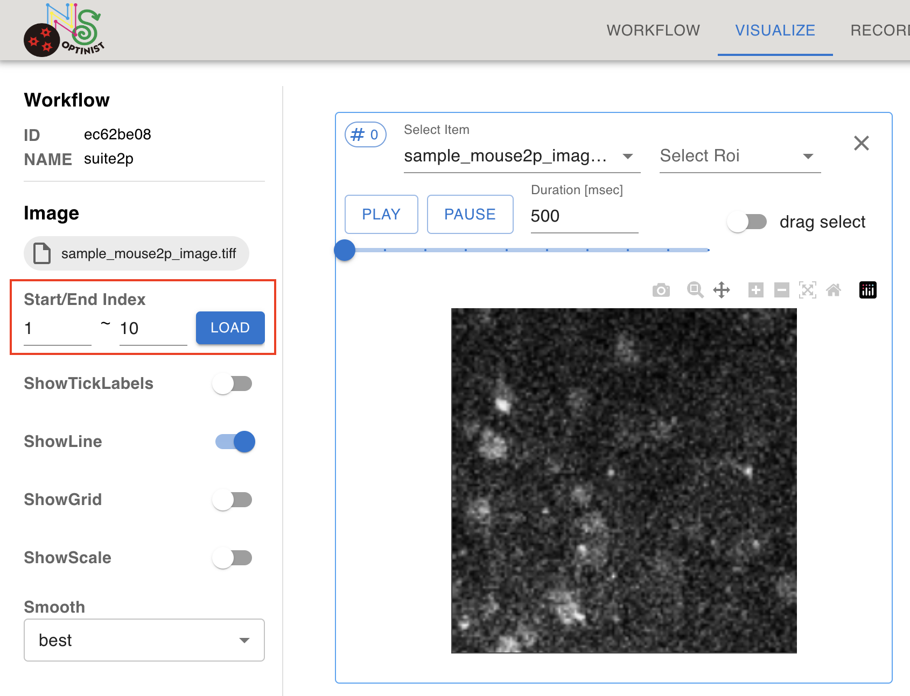
</p>

Click on the PLAY button within the plotting box to play the loaded movie.
The number indicated on the right of PAUSE button is the frame interval in milliseconds.

### Customizing Visualization Parameters
Select one of the display boxes by clicking inside of the box. The selected box will be highlighted with a blue outline.

The left sidebar shows the parameters available for the selected box.

<p align="center">
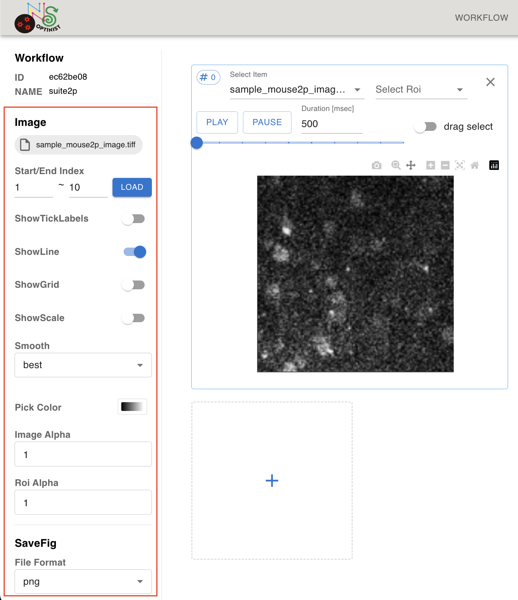
</p>

## ROI and timecourses
In order to visualise the fluorescence time series of ROI, two visualise boxes must be created and linked.

First create one box with the imaging data. Select the imaging data file (e.g. .tiff) from the `Select Item` drop down menu.

<br>
<p align="center">
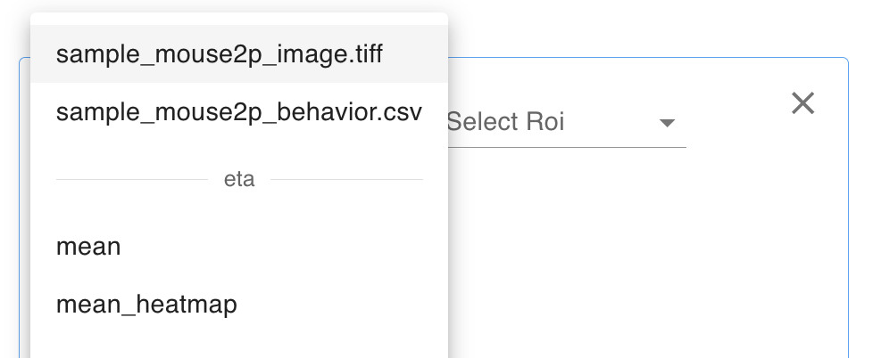
</p>

Then select the ROI (e.g. `cell_roi`). Both Suite2P and CaImAn include the process to remove the extracted ROIs that do not meet the criteria. You can visualise ROI that have been removed by selecting `non_cell_roi`.

<br>
<p align="center">

</p>

The plotting box (#0) shows the background image and detected cells. In OptiNiSt, a cell ID is given to all the ROIs and will be used for visualisation. Hover over an ROI to see the cell ID.

<br>
<p align="center">
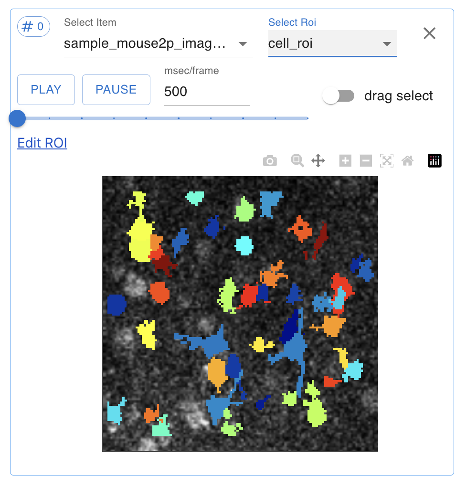
</p>

In another plotting box (e.g. #1), select fluorescence from the `Select Item` pulldown. Link two boxes by setting `Link to box (#)` in the fluorescence box to match the # of the ROI box (Number # of the box is on the left upper side). By clicking on the ROI of a cell, you can visualize the corresponding fluorescence time course in the fluorescence box.


<br>
<p align="center">
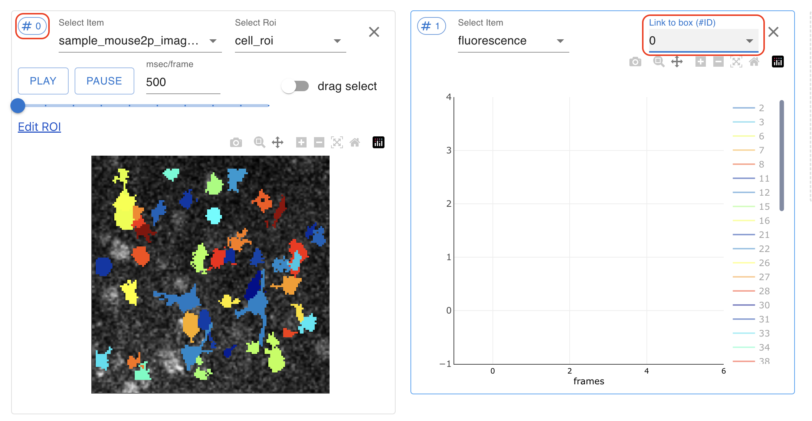
</p>


<br>
<p align="center">
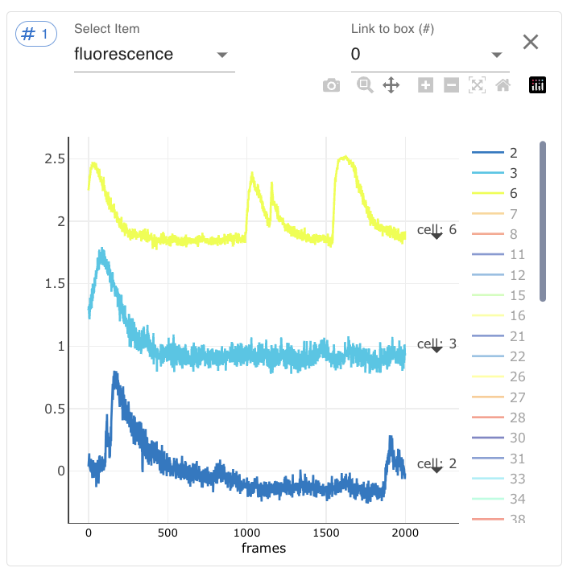
</p>

Once linked, TimeSeries plots will synchronize the ROI and time courses between boxes. The color of ROI and corresponding time course is matched. Clicking on the cell automatically adds the fluorescence time course of the clicked cell.

<br>
<p align="center">

</p>


You can select multiple ROI at once by turning on the `drag select` function on the right in the plotting box of ROI. It enables selecting all the ROI within the rectangular area you define.

<br>
<p align="center">

</p>

(SwitchTimeUnit)=
### Switch Time Course Plot Units

By default, timecourse plot's x axis is frame number. You can switch to time unit by clicking  `range unit` in left side bar.

<br>
<p align="center">

</p>

If you change unit to `time`, plot's x axis is changed to time(sec).

<br>
<p align="center">
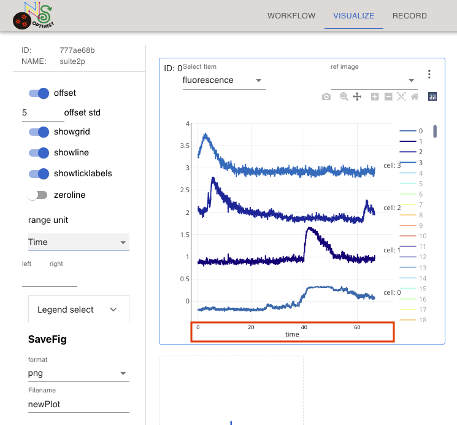
</p>

The time is calculated from imaging_plane.imaging_rate, in NWB settings.

<br>
<p align="center">
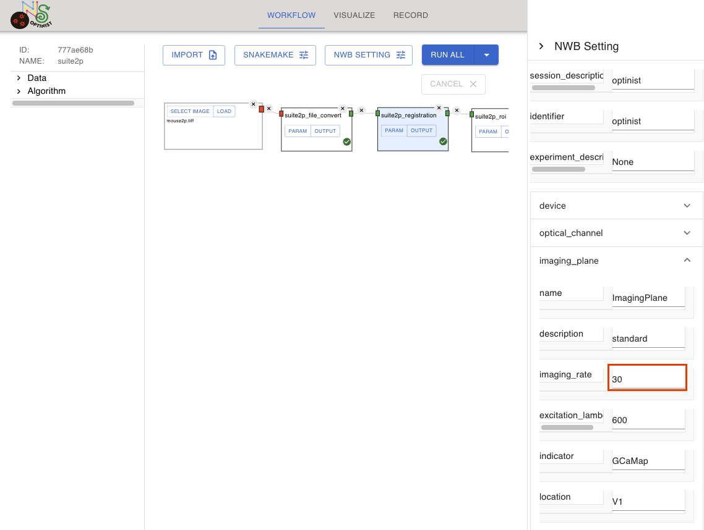
</p>

```{eval-rst}
.. important::
   The NWB settings parameter ``imaging_rate`` is also used as parameter for frame rate like ``fs`` in suite2p.
   So, confirm your imaging_rate is set correctly before running workflow.
```

(EditingROI)=
### Editing ROI

<p align="center">
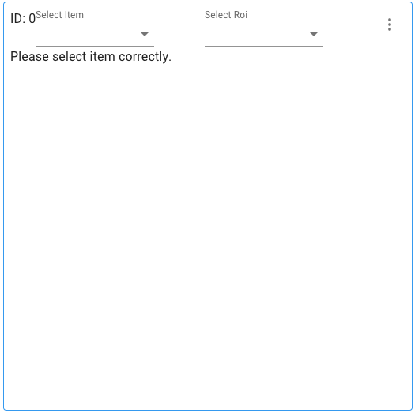
</p>

To the edit roi, open a plotting box.

<p align="center">

</p>

In one plotting box (e.g. #0), select a background image such as meanImg from the `Select Item` pulldowns.
In the same plotting box, select cell_roi from the `Select Roi` pull-downs. The plotting box (#0) will show the background image and detected cells.

<br>
<p align="center">

</p>

You can click the <strong>Add ROI</strong> button then drag-drop and resize the white circle to change the new ROI position and size.
Press <strong>OK</strong> or <strong>Cancel</strong> button to Add or No

<p align="center">
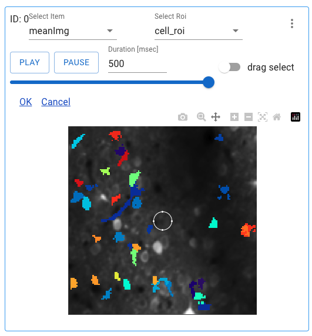
</p>

Or click on each cell ROI to delete ROI or merge ROIs (when you select 2 or more ROI cells)
Press <strong>Merge ROI</strong> or <strong>Delete ROI</strong> or <strong>Cancel</strong> button to Merge or Delete or Not. To keep changes and see them in the analysis you must </strong>Commit Edit</strong>.

<p align="center">
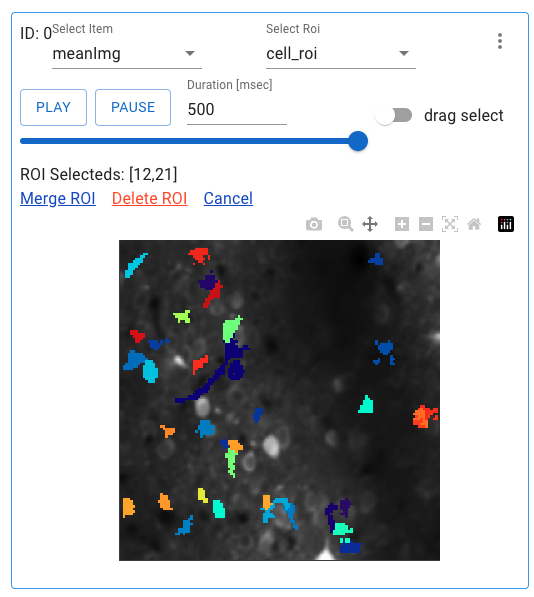
</p>


NWB file is overwritten with the ROI edit information.

```{eval-rst}
.. note::
  ROI edit information in NWB file

  - common

      - edited ROI ids are recorded in processing/optinist section

  - specific

      - merge

          - iscell data of ROIs to be merged changes to False
          - ROI after merge are added with new ID

      - delete

          - iscell data of deleted ROI changes to False.
```

## Saving Plots
You can save plots in SVG, PNG, JPEG, or WEBP format.

Please select the format and set the file name on the the `SaveFig` section in left panel. Then click the camera mark in the plotting box.

<p align="center">

</p>

SVG format saves the plot as a vector-based graphical format which may be convenient when you need high-resolution figures.
