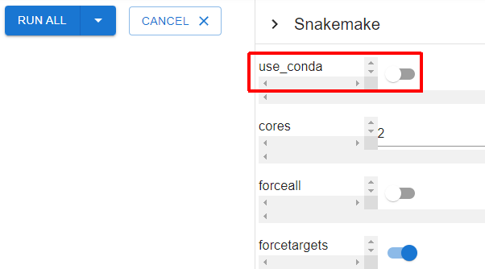

Mac for Developer
=================

```{contents}
:depth: 4
```

## Installation

We introduce how to install optinist for developer.
We have developed optinist python(backend) and typescript(frontend), so you need to make both environment.
Please follow instructions below.

## 1. Make backend environment

### Install Tools

- See below:
  - {ref}`mac-install-anaconda`

### Clone repository

```
git clone https://github.com/oist/optinist.git
cd ./optinist
```

### Create anaconda environment

**CAUTION**:
- *Due to issues with the operation of the use_conda function of the Windows version of snakemake, we will build an environment that does not use the above function here.*
- *However, this method is tentative (as of 2023/3) due to some limitations (e.g., mixed use of python modules).*


- Use conda-merge to merge the configuration yaml for each algorithm.
  ```
  pip install conda-merge

  conda-merge ./optinist/conda/*.yaml > /tmp/optinist_algos_env.yaml

  # Remove duplicate modules
  # Fixed python version to 3.8 in the following
  sed -i -e '/python=3.[^8]/d' /tmp/optinist_algos_env.yaml
  ```

- create conda env
  ```
  conda env create -n optinist_dev -f /tmp/optinist_algos_env.yaml
  conda activate optinist_dev
  ```

### Install requirements

```
pip install -r requirements.txt
```

### Set saving directory

Optinist default saving directory is `/tmp/optinist`. If you reboot your PC, this repogitory content is deleted. And setting the saving directory in environment path.
```bash
export OPTINIST_DIR="your_saving_dir"
```

<!--
## 2. Create virtualenv

Under maintenance...
-->

## 2. Run backend

```
python main.py
```
- `python main.py` log is as blow:
```
$ run_optinist
INFO:     Will watch for changes in these directories: ['/home/oist/optinist/backend']
INFO:     Uvicorn running on http://0.0.0.0:8000 (Press CTRL+C to quit)
INFO:     Started reloader process [6520] using statreload
INFO:     Started server process [6557]
INFO:     Waiting for application startup.
INFO:     Application startup complete.
```
- Launch browser, and go to http://localhost:8000

It opens correctly!

Done!

#### Note on workflow execution

**CAUTION**:
In this environment building procedure, use_conda of snakemake is not available, so please turn off the following settings before running workflow. (This must be set each time optinist is started.)


