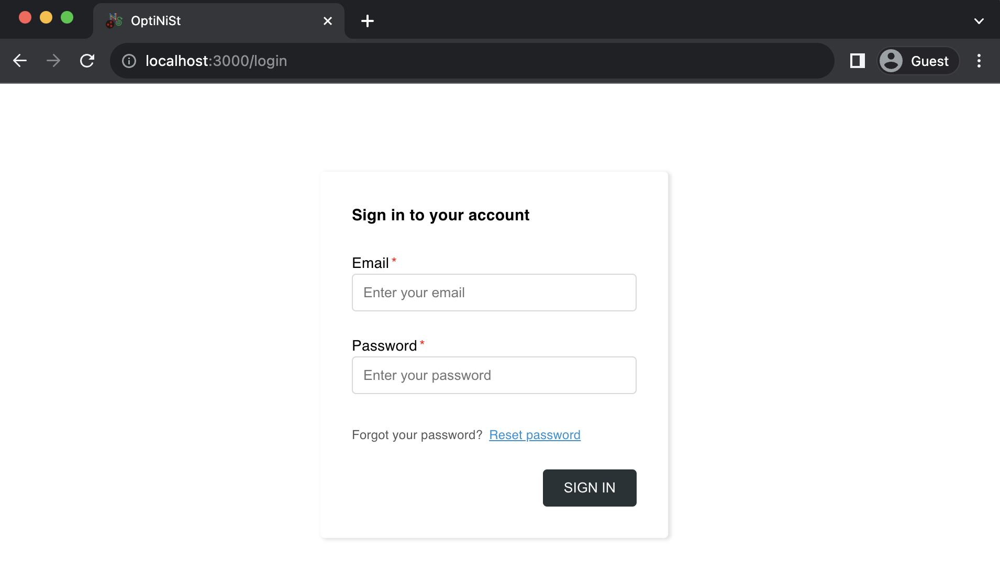
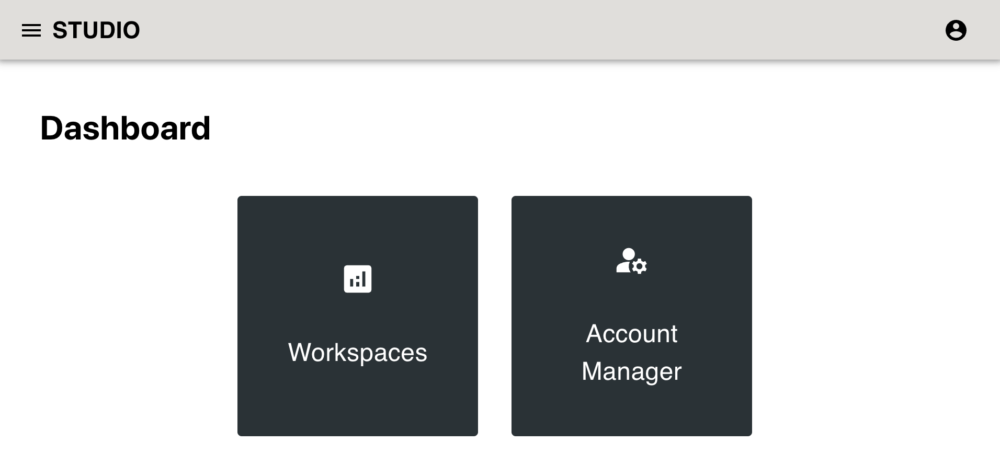
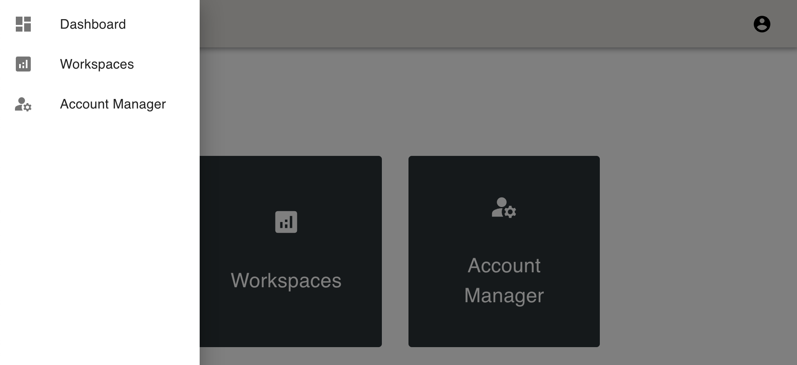
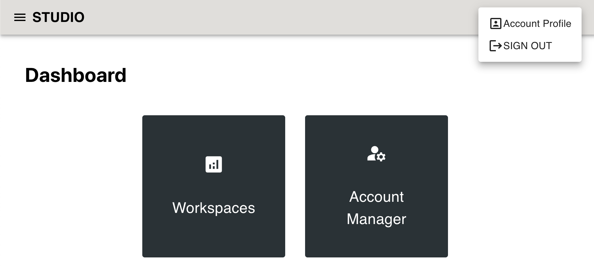
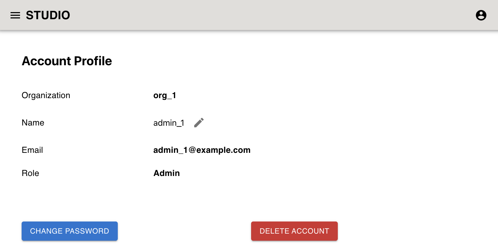
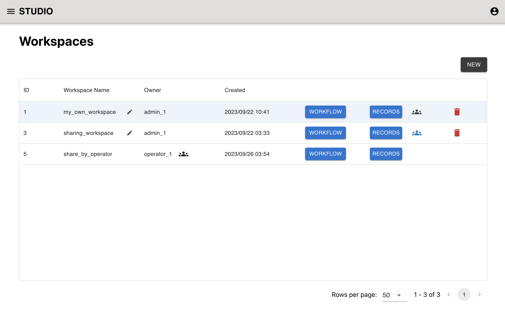
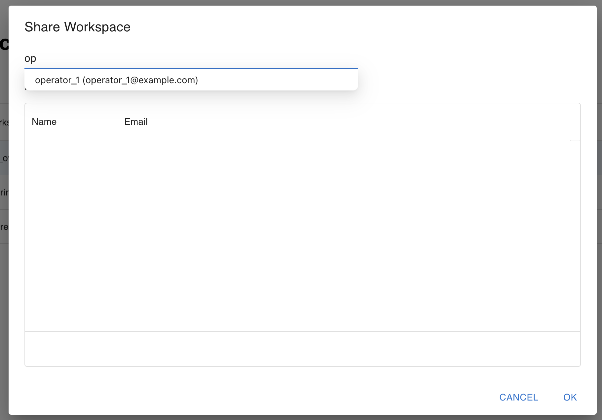
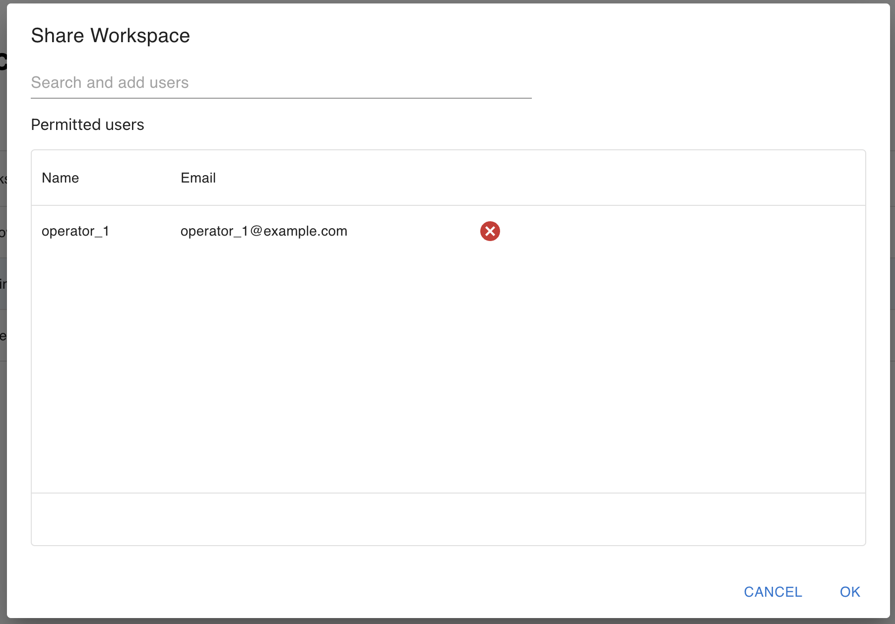
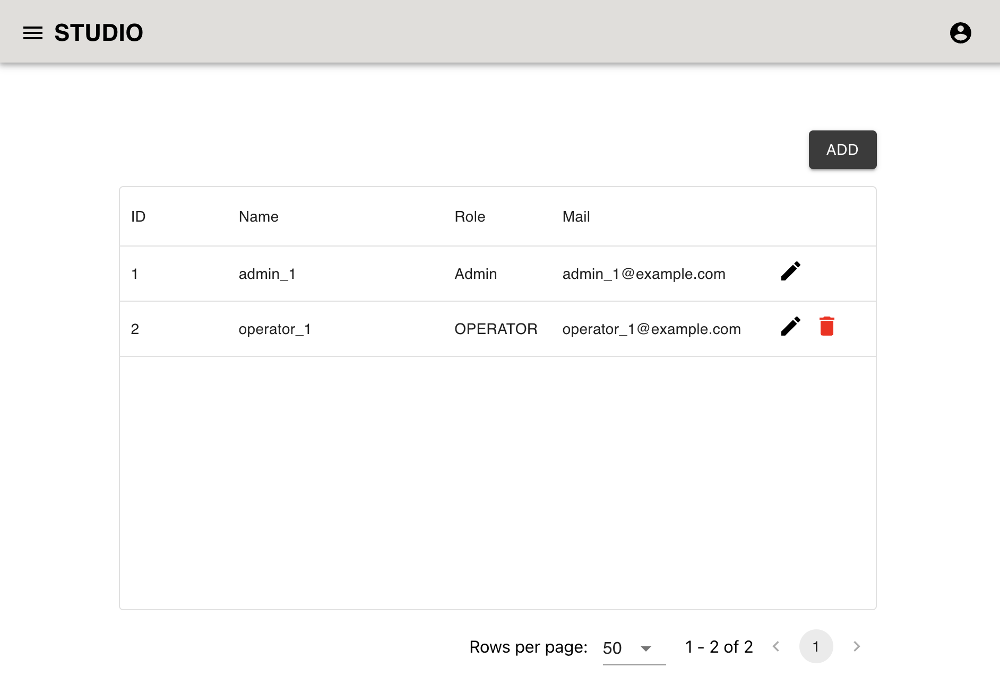

Multi-user (User)
=====================

```{contents}
:depth: 4
```

## Login
- Accessing the URL(`http://{YOUR_HOST}:8000`), you will see the login page.

<br>
<p align="center">

</p>


- Enter your email and password, then click "SIGN IN" button.
- If you forgot your password, click "Reset password" link.
  - You can reset your password by following the instructions in the email.
  - This feature is provided by Firebase Authentication. To customize the email template, see [https://firebase.google.com/docs/auth/web/manage-users#send_a_password_reset_email](https://firebase.google.com/docs/auth/web/manage-users#send_a_password_reset_email).

## Dashboard
- After login, you will see the dashboard page.
- There are two menus.
  - Workspaces
  - Account Manager
    - Only admin user can see & access this menu.

<br>
<p align="center">

</p>

- These menus can be accessed from sidebar shown by clicking the icon in the top left corner.

<br>
<p align="center">

</p>

- And by clicking icon in the top right corner, you can
  - See your Account Profile
  - Sign out

<br>
<p align="center">

</p>

## Account Profile
- In this page, you (include operator) can
  - see your account information
  - update your name (By clicking edit icon besides your name)
  - update your password
  - delete your account

<br>
<p align="center">

</p>


## Workspaces
- This is the workspace list page.
- Workspace is a collection of OptiNiSt workflows.
- You can
  - Create new workspace (By clicking "Add" button)
  - Go to workflow or records page.
    - These pages are same as single user mode.
  - Share workspace (By clicking share icon in the workspace row)
  - Edit workspace name (By clicking edit icon besides workspace name)
  - Delete workspace (By clicking delete icon in the workspace row)

<br>
<p align="center">

</p>


- Switching workspaces, you can run multiple workflows in parallel.
  - When you back to the workspace, you will see the last status of the workflow.

### Sharing workspace
- Workspaces are belong to the user who created it (owner).
- Shared users can
  - get files (workflow, snakemake, nwb files) of shared workflows
  - see workflow status and do visualize "the last" run result of shared workflows
- Shared users cannot
  - upload input files
  - run new workflow
  - edit, delete existing records


#### Share workspace
1. Click share icon in the workspace row.
2. Type the email address of the user you want to share.
3. Select suggested user.
4. Check permitted users list and click "OK" button.

<br>
<p align="center">

</p>

<br>
<p align="center">

</p>


- To unsare workspace, click "x" icon in the permitted users list.

#### Check shared workspaces
- Share icon of workspace you are sharing with someone else will be blue (not shared is black).
- Shared workspace has share icon beside owner name.

<br>
<p align="center">

</p>

So, in the image above,
- 1 (my_own_workspace) is created by you and not shared.
- 3 (sharing_workspace) is created by you and shared with someone else.
- 5 (share_by_operator) is created by operator_1 and shared with you.

## Account Manager
- This menu is only available for admin user.
- Admin user can
  - Create new user (By clicking "Add" button)
  - Edit users' name, role, email (By clicking edit icon in the users' row)
  - Delete users (By clicking delete icon in the users' row)

<br>
<p align="center">

</p>
