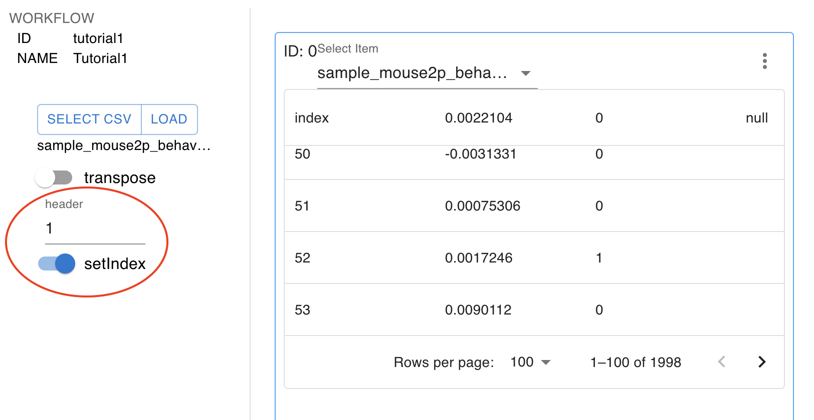
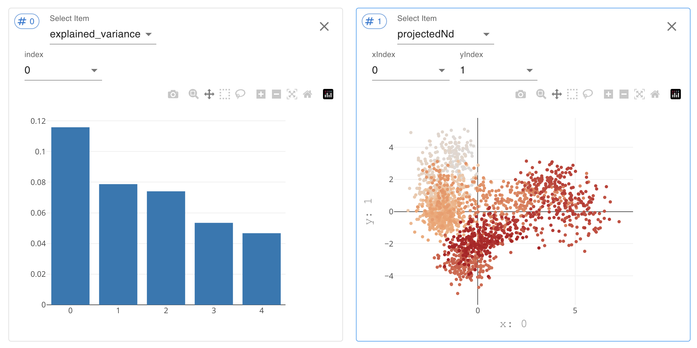

Tutorials
=================

This tutorial will walk you through the basic workflow of Optinist. You can read through this tutorial and try running Optinst on our sample dataset. Then you will be ready to start using Optinist on your own data.

* [Loading Sample data](#loading_sample_data)
* [Adding nodes to your Workflow](#adding-nodes-to-your-workflow)
* [Checking the data](#checking-the-data)
* [Selecting ROIs](#selecting-rois)
* [Visualising analysis algorithms](#visualising-analysis-algorithms)
* [Tutorial 2](#practice-with-tutorial-2)

## Loading Sample data
Let's begin by loading some sample data. The `Import sample data` button can be found by first selecting the `Documentation` button. This action moves the sample data into your Optinist [working directory](https://optinist.readthedocs.io/en/latest/gui/workflow.html#directory-setting).

Next, switch to the `[Record](https://optinist.readthedocs.io/en/latest/gui/record.html#record)` tab. This is where the records of all your workflows will be kept. You can conveniently reload any previous workflow from here. To load the tutorial workflow, select the `[Reproduce](https://optinist.readthedocs.io/en/latest/gui/record.html#reproduce-button)` icon. Note that you can download the [workflow, Snakemake, and NWB files](https://optinist.readthedocs.io/en/latest/gui/record.html#download-buttons) for use later.

Finally, switch back to the `Workflow` tab to see the loaded workflow. We'll use [Suite2P](https://suite2p.readthedocs.io/en/latest/index.html) to register (motion correct) the imaging data and visualize the Event Triggered Average (ETA).

Since this will be the first time running this data on your computer, you'll need to `RUN` the analysis.

## Adding nodes to your Workflow
You can easily add new `Data` and `Algorithm` nodes from the left-hand side menu. Let's practice by adding another type of analysis. Try selecting `PCA` (Principal Components Analysis) from the `Algorithm` menu. You'll need to connect the nodes with the [matching data type](https://optinist.readthedocs.io/en/latest/gui/workflow.html#connecting-nodes). Note that the opaque connector blocks are necessary, and the transparent blocks are optional. By connecting the blue blocks, only the ROIs that are confirmed as cells will be used for PCA.

Notice how the new node changes color. This will also happen anytime you change a parameter. You'll need to `Run` the analysis again. Conveniently, Optinist checks which nodes are affected by changes and only runs what is necessary.

## Checking the data
You may want to check the data after uploading it. Switch to the `Visualize` tab. Press the `+` icon to add a new window. Select the imaging data you want to see. If you adjust the start and end time, remember to press `LOAD` afterwards. You can also see the effectiveness of the motion correction by loading your original data and the motion corrected `mc_images` in side-by-side windows.

It is also possible to check your behavioural csv data in the Visualize tab. You can set the number of `header` rows to ignore at the top of your csv, and see how this affected the data indices.

## Selecting ROIs
To visualise ROIs you first need to follow these steps:
1. Open a window and select your imaging dataset.
2. In the dropdown menu that appears to the right select the ROI type. Let's start by checking `cell_roi`.
3. Open a second window and in the drop-down menu select `fluorescence` under the suite2p_roi header.
4. Link the two windows using `ref image`, inputing the # of the other window.
5. Select an ROI to see by clicking on the ROI mask or the ROI ID in the legend.

Optinist reproduces many of the amazing [ROI editing](https://optinist.readthedocs.io/en/latest/gui/visualize.html#editing-roi) functions of Suite2p.
You can move ROIs between the `non_cell_roi` and `cell_roi` categories using `Add ROI` and `Delete ROI`.
By clicking on more than one ROI mask, you can also `Merge ROI`. The selected ROIs will become a single new ROI with a new fluorescence time course will appear at the end of legend.

## Visualising analysis algorithms
Finally, let's check the ETA analysis. Open up a new window and select `mean` under the ETA header of the drop-down menu. Link this window to your data to only see the `cell_roi` data. Then select and ROI from the legend. You'll see the mean trace across all of the time points specified by 1s in the `Sample_mouse2p_behavior.csv` file. You can also see a heatmap of all of the data using `mean_heatmap`. If you want to see longer pre- or post-stimulus periods, you can go back to `Workflow`, adjust the parameters and `RUN` again.

## Practice with Tutorial 2
Now it's your turn. Try loading `Tutorial 2` from the `Record` tab. Don't forget to `RUN` it the first time. Then see if you can visualise the `explained_variance` and `projectedNd`.
Can you recreate the figure below?

########################################################
Previous Tutorial
########################################################

### ROI extraction

You can easily create the above workflow with the following [GUI operations](https://optinist.readthedocs.io/en/latest/gui/workflow.html),
1. Assign input image data
	- You can select a group of files for analysis in one of two ways.
		* Select files or folders in a predefined folder with the SELECT button
		* Select any local files or folders with the LOAD button
2. Select analysis method
	- You can add the required analysis methods to workflow from the left pane.
	- Currently we offer the following three methods of ROI detection
		* [suite2p](https://github.com/MouseLand/suite2p)
		* [CaImAn](https://github.com/flatironinstitute/CaImAn)
		* [LCCD](https://github.com/magnetizedCell/lccd-python)
3. Create pipeline
	- You can build an analysis pipeline by connecting input data and analysis modules.
	- The nodes should be connected as long as the input and the output are of the same format type (same color).
4. Press the RUN ALL button to execute the workflow.

Note: Optinist can finely modify each of the following settings and parameters See [here](https://optinist.readthedocs.io/en/latest/gui/workflow.html)  for more details.
- Snakemake
- NWB
- Analysis modules

### Time series analyses

OptiNiSt offers some basic time-series analysis functions. For example, event-triggered averaging can be applied to the ROI time-series data created by OptiNiSt. Assuming that you have the result of ROI extraction, here explains how to create the pipeline. Because the ROI time-series is in NWB format, the hdf5 data node is appropriate as the input node.

Add the hdf5 node to the field. In addition to assign the file, you need to indicate the position of the fluorescence data in the HDF5 structure (STRUCTURE button appeared after you SELECT HDF5).

In this example, the behavioral data format is .csv. The csv data node or behavior data node is used for behavior input.
Once you SELECT CSV, SETTINGS button appears in the behavior node. This button confirms the inside of csv data and makes it possible to transpose the matrix if needed. If your csv includes the headers, you can also assign it to ignore it in creating the matrix. Set Index adds index columns to the matrix.

Add event tirggered averaging (eta) node and connect fluorescence and behavior nodes to eta node. And Run the workflow.
After finishing the process, you can quickly confirm your event-triggered average plot by clicking the OUTPUT button on the eta node.
The plots are for quick confirmation of the results. If you want to look into the results more in detail,   available variables are all saved in the OptiNiSt output in NWB format. They are saved in processing/optinist inside NWB file. The NWB file is easily retrieved at RECORD page with just one click. To inspect the data, [HDFView](https://www.hdfgroup.org/downloads/hdfview/) is convenient.

### Example

 

As for Suite2P, you might not use "suite2P_registration" (motion correction) node. In that case, you can connect the "suite2p_file_convert" node to "suite2p_roi" node directly.

 

Also, you can perform "motion correction" of CaImAn (caiman_mc) and then perform "suite2P_roi".

 

You can branch the flow. In the example, the two "caiman_mc" with different parameter settings are created, and the downstream from "caiman_mc" is also different. Each node's results are saved separately (See [RECORD part](#managing-pipelines-on-record)).

## Check execution result on VISUALIZE
After executing the workflow, you may want to check and compare the results.

Here is an overview of the features on the VISUALIZE page
 - Key features:
	* Customize visualization parameters
	* Display ROI and time courses
	* Save plots in various formats
	* Link ROI plots and fluorescence time series
	* Explore ROIs and time courses
	* Edit ROIs: Add, merge, or delete ROIs

See [here](https://optinist.readthedocs.io/en/latest/gui/visualize.html) for detail usage.

## Managing pipelines on RECORD

The RECORD page summarizes the current status of `OPTINIST_DIR/output`.
This page helps keep the analysis pipeline organized and easy to retrieve.
For basic usage of the RECORD page, see [here](https://optinist.readthedocs.io/en/latest/gui/record.html).

### Sample pipelines

We provide some sample pipelines `optinist/sample_data/workflows/`.
You can immediately see the three results by copying this pipeline to `OPTINIST_DIR`.

 

 

You can reproduce these pipelines instantly by clicking on each reproduce button.
In addition, by clicking the `RUN` button in the upper right corner of the Workflow screen
to confirm that you can load the results of an analysis that has already been run.

Note: Unfortunately, this feature may not work properly at this time due to a bug.
