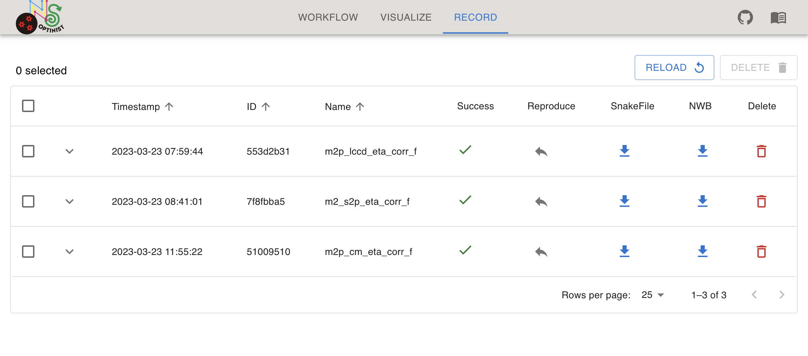
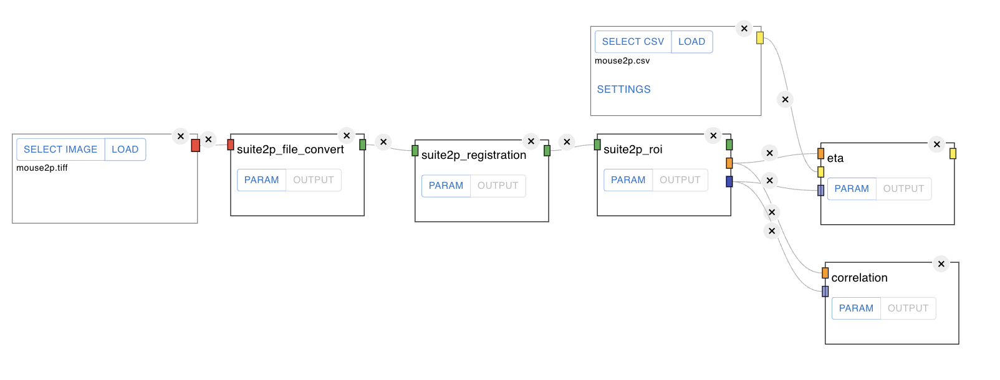
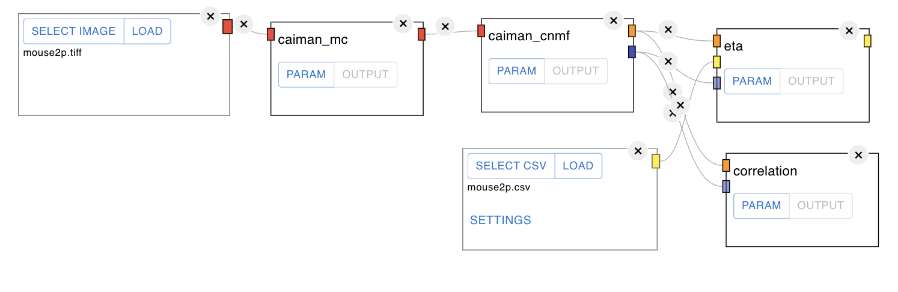
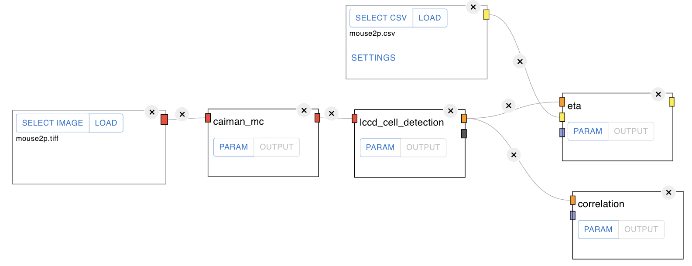

Tutorials
=================

* [Opening the browser](#opening-the-browser)
* [Making pipelines on WORKFLOW](#making-pipelines-on-workflow)
	* [ROI extraction](#roi-extraction)
	* [Time series analyses](#time-series-analyses)
	* [Pipeline example](#pipeline-example)
* [Check execution result on VISUALIZE](#check-execution-result-on-visualize)
* [Managing pipelines on RECORD](#managing-pipelines-on-record)
 	* [Sample pipelines](#sample-pipelines)

## Opening the browser
To start OptiNiSt, follow these steps:

1. Open a console.
2. Activate the optinist environment with the command: `conda activate optinist`.
3. Change to the optinist directory using the command: `cd ~/optinist/`.
4. Run the main script with the command: `python main.py`.

If you installed OptiNiSt using pip, you can also start it with the `run_optinist` command.

 

The console will display the log once the startup is completed.

Once you see this, 
1. Open your web browser (Google Chrome is recommended).
2. Navigate to `localhost:8000`.

 

You are ready to start using OptiNiSt if the OptiNiSt page appears.
You can switch between these pages by clicking on the corresponding tabs (WORKFLOW, VISUALIZE, RECORD).

## Making pipelines on WORKFLOW 
After launching, the first page you see is the workflow page. The workflow page is a place to define the analysis pipeline. You determine the data you will analyze, select the type of the algorithm or analysis method you use, and set the parameters and the order of analysis.  

### ROI extraction

You can easily create the above workflow with the following [GUI operations](https://optinist.readthedocs.io/en/latest/gui/workflow.html),
1. Assign input image data
	- You can select a group of files for analysis in one of two ways.
		* Select files or folders in a predefined folder with the SELECT button
		* Select any local files or folders with the LOAD button 
2. Select analysis method
	- You can add the required analysis methods to workflow from the left pane.
	- Currently we offer the following three methods of ROI detection
		* [suite2p](https://github.com/MouseLand/suite2p)
		* [CaImAn](https://github.com/flatironinstitute/CaImAn)
		* [LCCD](https://github.com/magnetizedCell/lccd-python)
3. Create pipeline
	- You can build an analysis pipeline by connecting input data and analysis modules. 
	- The nodes should be connected as long as the input and the output are of the same format type (same color).
4. Press the RUN ALL button to execute the workflow.
 
Note: Optinist can finely modify each of the following settings and parameters See [here](https://optinist.readthedocs.io/en/latest/gui/workflow.html)  for more details.
- Snakemake
- NWB
- Analysis modules

### Time series analyses

OptiNiSt offers some basic time-series analysis functions. For example, event-triggered averaging can be applied to the ROI time-series data created by OptiNiSt. Assuming that you have the result of ROI extraction, here explains how to create the pipeline. Because the ROI time-series is in NWB format, the hdf5 data node is appropriate as the input node. 

Add the hdf5 node to the field. In addition to assign the file, you need to indicate the position of the fluorescence data in the HDF5 structure (STRUCTURE button appeared after you SELECT HDF5).

In this example, the behavioral data format is .csv. The csv data node or behavior data node is used for behavior input. 
Once you SELECT CSV, SETTINGS button appears in the behavior node. This button confirms the inside of csv data and makes it possible to transpose the matrix if needed. If your csv includes the headers, you can also assign it to ignore it in creating the matrix. Set Index adds index columns to the matrix.

Add event tirggered averaging (eta) node and connect fluorescence and behavior nodes to eta node. And Run the workflow. 
After finishing the process, you can quickly confirm your event-triggered average plot by clicking the OUTPUT button on the eta node.
The plots are for quick confirmation of the results. If you want to look into the results more in detail,   available variables are all saved in the OptiNiSt output in NWB format. They are saved in processing/optinist inside NWB file. The NWB file is easily retrieved at RECORD page with just one click. To inspect the data, [HDFView](https://www.hdfgroup.org/downloads/hdfview/) is convenient. 

### Pipeline example

 

As for Suite2P, you might not use "suite2P_registration" (motion correction) node. In that case, you can connect the "suite2p_file_convert" node to "suite2p_roi" node directly. 

 

Also, you can perform "motion correction" of CaImAn (caiman_mc) and then perform "suite2P_roi".

 

You can branch the flow. In the example, the two "caiman_mc" with different parameter settings are created, and the downstream from "caiman_mc" is also different. Each node's results are saved separately (See [RECORD part](#managing-pipelines-on-record)). 

## Check execution result on VISUALIZE
After executing the workflow, you may want to check and compare the results.

Here is an overview of the features on the VISUALIZE page
 - Key features:
	* Customize visualization parameters
	* Display ROI and time courses
	* Save plots in various formats
	* Link ROI plots and fluorescence time series
	* Explore ROIs and time courses
	* Edit ROIs: Add, merge, or delete ROIs

See [here](https://optinist.readthedocs.io/en/latest/gui/visualize.html) for detail usage.

## Managing pipelines on RECORD

The RECORD page summarizes the current status of `OPTINIST_DIR/output`. 
This page helps keep the analysis pipeline organized and easy to retrieve. 
For basic usage of the RECORD page, see [here](https://optinist.readthedocs.io/en/latest/gui/record.html).

### Sample pipelines 

We provide some sample pipelines `optinist/sample_data/workflows/`.
You can immediately see the three results by copying this pipeline to `OPTINIST_DIR`.

 

 

You can reproduce these pipelines instantly by clicking on each reproduce button.
In addition, by clicking the `RUN` button in the upper right corner of the Workflow screen
to confirm that you can load the results of an analysis that has already been run.

Note: Unfortunately, this feature may not work properly at this time due to a bug.
