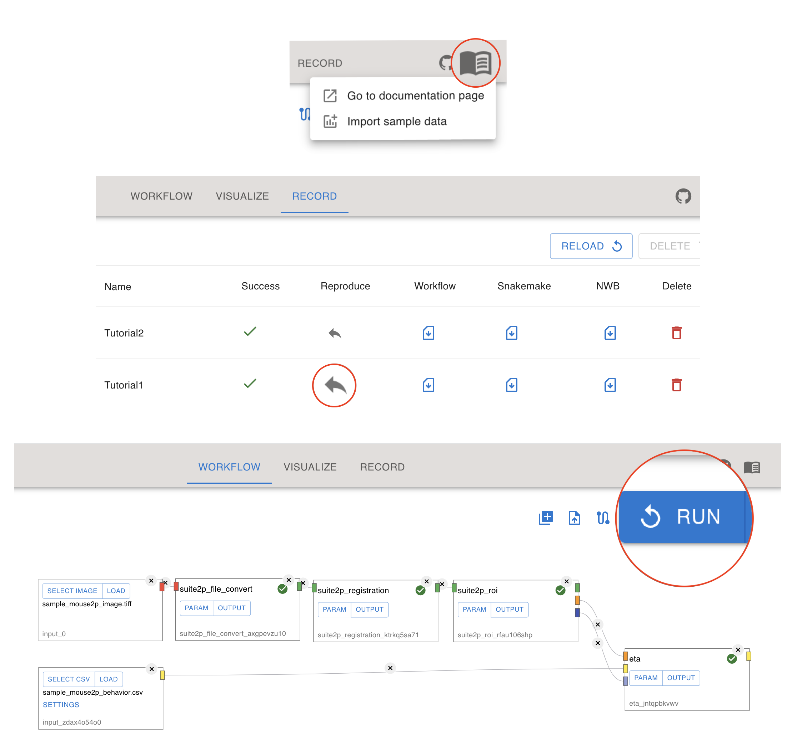
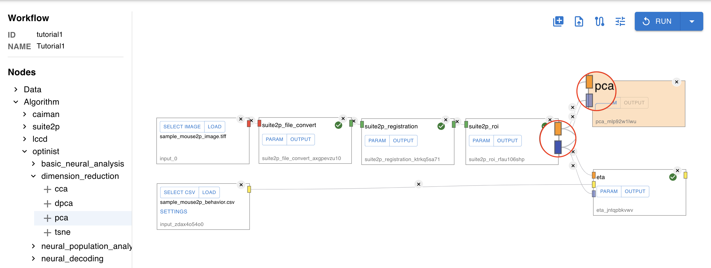
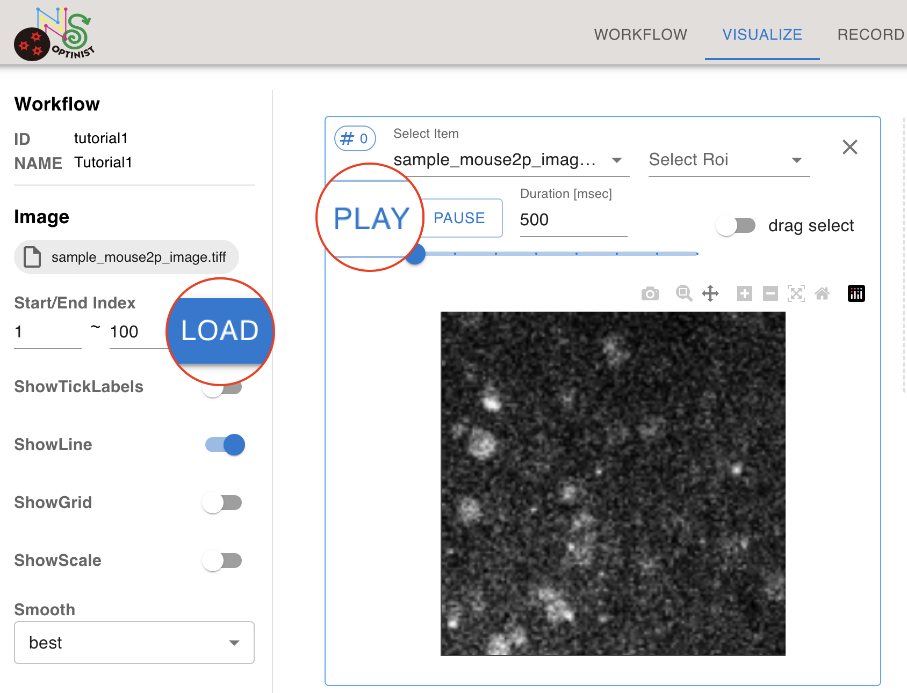
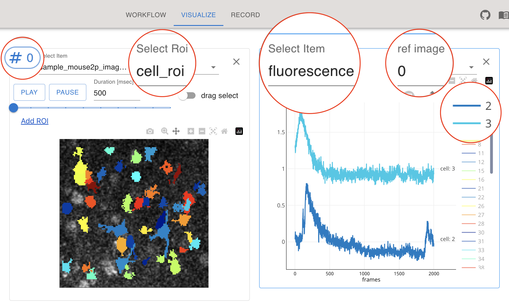
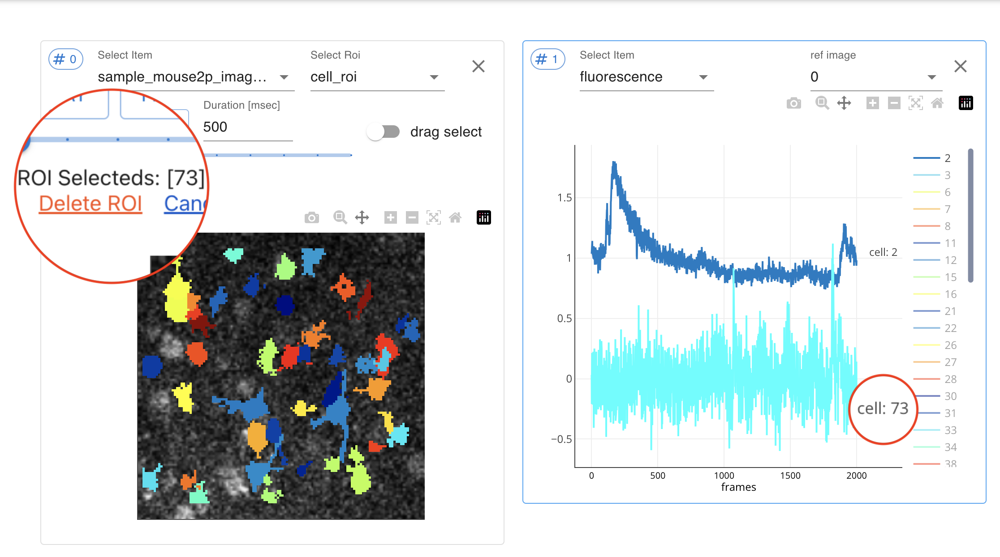
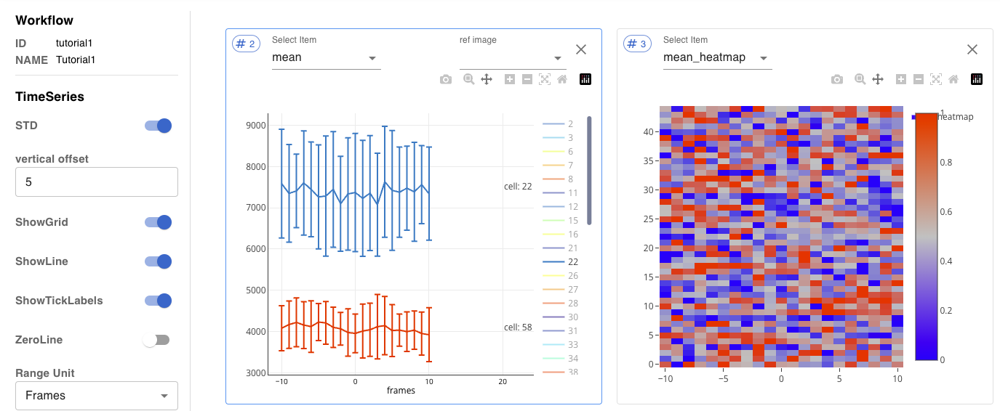
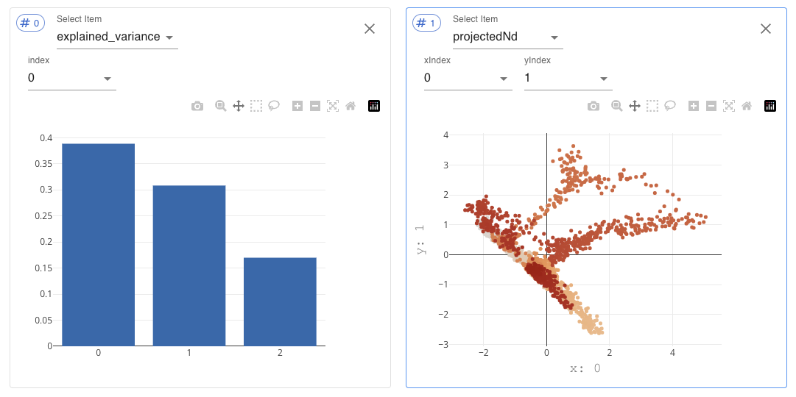

Tutorials
=================

This tutorial will walk you through the basic workflow of Optinist. You can read through this tutorial and try running Optinst on our sample dataset. Then you will be ready to start using Optinist on your own data.

* [Loading Sample data](#loading-sample-data)
* [Adding nodes to your Workflow](#adding-nodes-to-your-workflow)
* [Checking the data](#checking-the-data)
* [Selecting ROIs](#selecting-rois)
* [Visualising analysis algorithms](#visualising-analysis-algorithms)
* [Tutorial 2](#practice-with-tutorial-2)

## Loading Sample data
Let's begin by loading some sample data. The `Import sample data` button can be found by first selecting the `Documentation` button. This action moves the sample data into your Optinist [working directory](#DirectorySetting).

Next, switch to the [Record](#Record) tab. This is where the records of all your workflows will be kept. You can conveniently reload any previous workflow from here. To load the tutorial workflow, select the [Reproduce](#ReproduceButton) icon. Note that you can download the [Workflow, Snakemake, and NWB files](#DownloadButtons) for use later.

Finally, switch back to the `Workflow` tab to see the loaded workflow. We'll use [Suite2P](https://suite2p.readthedocs.io/en/latest/index.html) to register (motion correct) the imaging data and visualize the Event Triggered Average (ETA).

Since this will be the first time running this data on your computer, you'll need to `RUN` the analysis.

## Adding nodes to your Workflow
You can easily add new `Data` and `Algorithm` nodes from the left-hand side menu. Let's practice by adding another type of analysis. Try selecting `PCA` (Principal Components Analysis) from the `Algorithm` menu. You'll need to connect the nodes with the [matching data type](#ConnectingNodes). Note that the opaque connector blocks are necessary, and the transparent blocks are optional. By connecting the blue blocks, only the ROIs that are confirmed as cells will be used for PCA.

Notice how the new node changes color. This will also happen anytime you change a parameter. You'll need to `Run` the analysis again. Conveniently, Optinist checks which nodes are affected by changes and only runs what is necessary.

## Checking the data
You may want to check the data after uploading it. Switch to the `Visualize` tab. Press the `+` icon to add a new window. Select the imaging data you want to see. If you adjust the start and end time, remember to press `LOAD` afterwards. You can also see the effectiveness of the motion correction by loading your original data and the motion corrected `mc_images` in side-by-side windows.

It is also possible to check your behavioural csv data in the Visualize tab. You can set the number of `header` rows to ignore at the top of your csv, and see how this affected the data indices.

## Selecting ROIs
To visualise ROIs you first need to follow these steps:
1. Open a window and select your imaging dataset.
2. In the dropdown menu that appears to the right select the ROI type. Let's start by checking `cell_roi`.
3. Open a second window and in the drop-down menu select `fluorescence` under the suite2p_roi header.
4. Link the two windows using `ref image`, inputing the # of the other window.
5. Select an ROI to see by clicking on the ROI mask or the ROI ID in the legend.

Optinist reproduces many of the amazing [ROI editing](#EditingROI) functions of Suite2p.
You can move ROIs between the `non_cell_roi` and `cell_roi` categories using `Add ROI` and `Delete ROI`.
By clicking on more than one ROI mask, you can also `Merge ROI`. The selected ROIs will become a single new ROI with a new fluorescence time course will appear at the end of legend.

## Visualising analysis algorithms
Finally, let's check the ETA analysis. Open up a new window and select `mean` under the ETA header of the drop-down menu. Link this window to your data to only see the `cell_roi` data. Then select and ROI from the legend.

You'll see the mean trace across all of the time points specified by 1s in the `sample_mouse2p_behavior.csv` file. Also std can be displayed by setting `STD` in the left side-bar to True.

You can also see a heatmap of all of the data using `mean_heatmap`. If you want to see longer pre- or post-stimulus periods, you can go back to `Workflow`, adjust the parameters and `RUN` again.

## Practice with Tutorial 2
Now it's your turn. Try loading `Tutorial 2` from the `Record` tab. Don't forget to `RUN` it the first time. Then see if you can visualise the `explained_variance` and `projectedNd`.
You would recreate the figure below.

