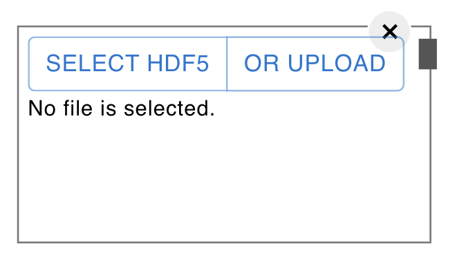
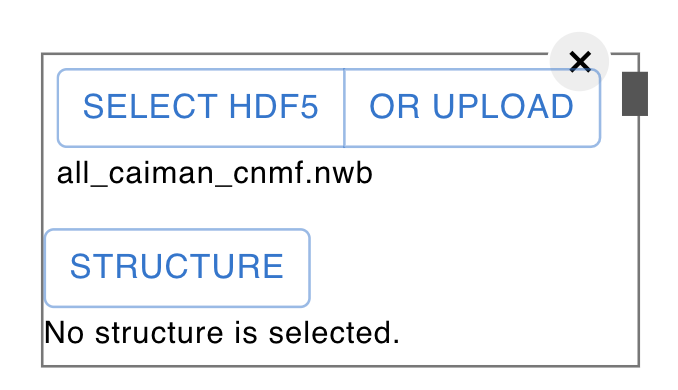
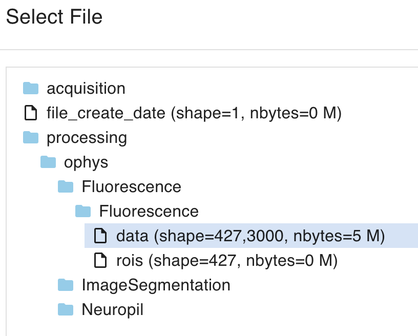
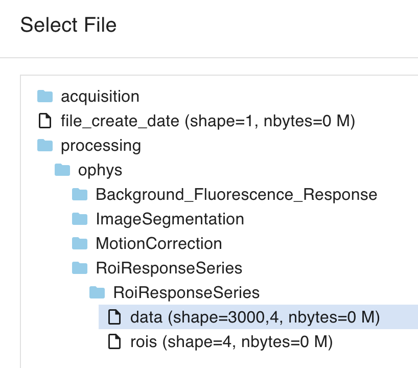
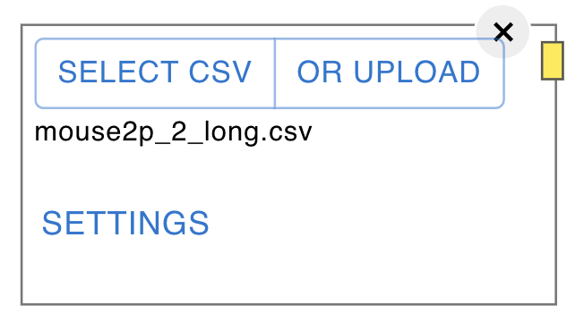
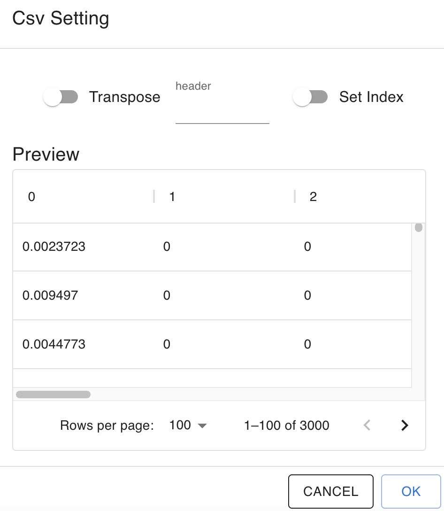
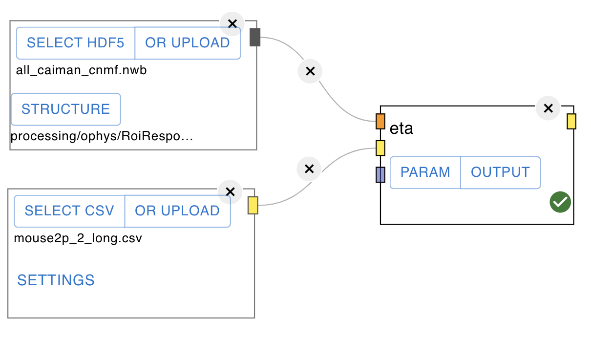
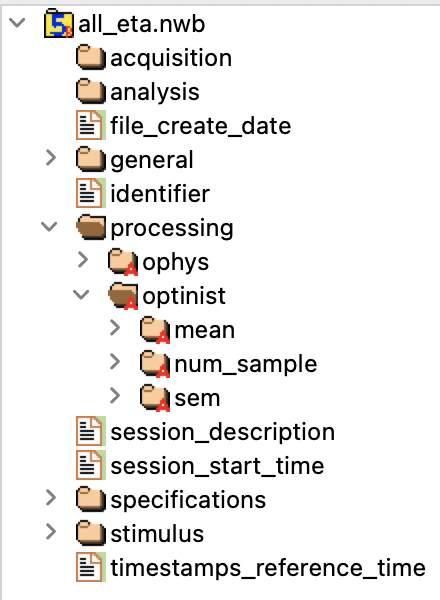

Tutorials
=================

* [Opening the browser](#opening-the-browser)
* [Making pipelines on WORKFLOW](#making-pipelines-on-workflow)
  * [Assigning input data path](#assigning-input-data-path)
  * [Selecting analysis methods](#selecting-analysis-methods)
  * [Creating pipelines](#creating-pipelines)
    * [Pipeline example](#pipeline-example)
  * [Parameter button and output button on the node](#parameter-button-and-output-button-on-the-node)
  * [running pipelines](#running-pipelines)
  * [SNAKEMANE and NWB SETTING](#snakemane-and-nwb-setting)
  * [Time series analyses after ROI extraction](#time-series-analyses-after-roi-extraction)
  * [Additional information on WORKFLOW](#additional-information-on-workflow)
     * [setting OPTINIST_DIR](#setting-optinist_dir)
     * [about the assumed data shape](#about-the-assumed-data-shape)
     * [snakemake settings](#snakemake-settings)
     * [NWB settings](#nwb-settings)
* [Inspecting the images and the plots on VISUALIZE](#inspecting-the-images-and-the-plots-on-visualize)
  * [Checking movies](#checking-movies)
  * [Showing ROI and time courses](#showing-roi-and-time-courses)
  * [Editing ROI](#editing-roi)
  * [Savind plots](#savind-plots)
* [Managing pipelines on RECORD](#managing-pipelines-on-record)
  * [Reproduce Button](#reproduce-button)
  * [Download Buttons](#download-buttons)

## Opening the browser
To start OptiNiSt, follow these steps:

1. Open a console.
2. Activate the optinist environment with the command: `conda activate optinist`.
3. Change to the optinist directory using the command: `cd ~/optinist/`.
4. Run the main script with the command: `python main.py`.

If you installed OptiNiSt using pip, you can also start it with the `run_optinist` command.

 

The console will display the log once the startup is completed.

Once you see this, 
1. Open your web browser (Google Chrome is recommended).
2. Navigate to `localhost:8000`.

 

You are ready to start using OptiNiSt if the OptiNiSt page appears.
You can switch between these pages by clicking on the corresponding tabs (WORKFLOW, VISUALIZE, RECORD).

## Making pipelines on WORKFLOW 
After launching, the first page you see is the workflow page. The workflow page is a place to define the analysis pipeline. You determine the data you will analyze, select the type of the algorithm or analysis method you use, and set the parameters and the order of analysis.  

### Assigning input data path

### Selecting analysis methods

### Creating pipelines

 

Connect the analysis nodes in the order you like to process. Drugging from an output connector of a node to the input connector of the next node creates an edge. The color of the connector indicates the format. 

For example, red is the image type format. You can only connect the same color. (Exception: black is an undefined data format. You can connect the black connector with any other connector, but be careful it does not check the consistency of input and output).

#### Pipeline example

 

As for Suite2P, you might not use "suite2P_registration" (motion correction) node. In that case, you can connect the "suite2p_file_convert" node to "suite2p_roi" node directly. 

 

Also, you can perform "motion correction" of CaImAn (caiman_mc) and then perform "suite2P_roi".

 

The nodes should be connected as long as the input and the output are of the same format type (same color).
Also, you can branch the flow. In the example, the two "caiman_mc" with different parameter settings are created, and the downstream from "caiman_mc" is also different. Each node's results are saved separately (See [RECORD part](#managing-pipelines-on-record)). 

### running pipelines

### SNAKEMANE and NWB SETTING

SNAKEMAKE and NWB SETTING buttons are for parameters for snakemake and output NWB file.
The pipeline construction of Optinist is based on [snakemake](https://snakemake.readthedocs.io/en/stable/), which is the pipeline controlling tool for python scripts. The SNAKEMAKE parameter setting is [explained bellow](#snakemake-settings).

 

NWB SETTING defines the metadata associated with the input data. By setting this, the output NWB file includes the information set here. The parameter you set here is only for your record and not used for the calculation inside OptiNiSt. You can leave this as default. The details of NWB setting in OptiNiSt is [explained bellow](#nwb-settings). Also, general info about NWB is [here](https://www.nwb.org/getting-started/).

### Time series analyses after ROI extraction
OptiNiSt offers some basic time-series analysis functions. For example, event-triggered averaging can be applied to the ROI time-series data created by OptiNiSt. Assuming that you have the result of ROI extraction, here explains how to create the pipeline. Because the ROI time-series is in NWB format, the hdf5 data node is appropriate as the input node. 

 

Add the hdf5 node to the field. Upload the data to the OPTINIST_DIR. In addition to UPLOAD and SELECT to assign the file, you need to indicate the position of the fluorescence data in the HDF5 structure (STRUCTURE button appeared after you SELECT HDF5).

 

NWB structure of Suite2P and CaImAn is different because OptiNiSt inherits each algorithm's original NWB output format. You will find the colums and rows are opposite between Suite2P outputs and CaImAn outputs. You can re-assign the rows and columns in the parameter setting of the analysis node. 

 

 

In this example, the behavioral data format is .csv. The csv data node or behavior data node is used for behavior input. 

 

Once you SELECT CSV, SETTINGS button appears in the behavior node. This button confirms the inside of csv data and makes it possible to transpose the matrix if needed. If your csv includes the headers, you can also assign it to ignore it in creating the matrix. Set Index adds index columns to the matrix.

 

Add event tirggered averaging (eta) node and connect fluorescence and behavior nodes to eta node. And Run the workflow. 

 

After finishing the process, you can quickly confirm your event-triggered average plot by clicking the OUTPUT button on the eta node. This figure is also available at VISUALIZE page.

 

The plots are for quick confirmation of the results. If you want to look into the results more in detail,   available variables are all saved in the OptiNiSt output in NWB format. They are saved in processing/optinist inside NWB file. The NWB file is easily retrieved at RECORD page with just one click. To inspect the data, [HDFView](https://www.hdfgroup.org/downloads/hdfview/) is convenient. 

 

### Additional information on WORKFLOW

##### setting OPTINIST_DIR
The file assigning the OPTINIST_DIR is optinist/optinist/api/dir_path.py. Change line for OPTINIST_DIR, INPUT_DIR, and OUTPUT_DIR according to your demand. Changing dir_path.py may also be necessary when running the pipeline on your cluster computers. Also, you can quickly change OPTINIST_DIR by changing the environment variable by typing 'export OPTINIST_DIR="your_saving_dir"' before launching.

#### about the assumed data shape 
eta, cca, correlation, cross_correlation, granger, glm, lda, and svm assume the input neural data shape is frames x cells matrix. Because the output of CaImAn and Suite2P on the pipeline is cell x frames, the default setting for neural data for these analyses is set to transpose. 

Pca and tsne can be done in either direction depending on your purpose. The function assumes their input to be samples x features.  

##### snakemake settings
For details about snakemake parameters please refer to [here](https://snakemake.readthedocs.io/en/stable/executing/cli.html) 
 
use_conda: If this is on, snakemake uses conda environment. 
cores: Specifies the number of cores to use. If not specified, snakemake uses number of available cores in the machine.  
forceall: Flag to indicate the execution of the target regardless of already created output. 
forcetargets: Users may not want to change this.  
lock: Users may not want to change this.   

##### NWB settings
For detais about NWB please refer to [here](https://pynwb.readthedocs.io/en/latest/pynwb.file.html) 
 
session_description: a description of the session where this data was generated  
identifier: a unique text identifier for the file   
experiment_description: general description of the experiment  
device: device used to aquire the data (information such as manufacturer, firmware version, model etc.)  
optical_channel: information about the optical channel used to acquire the data  
imaging_plane: information about imaging such as sampling rate, excitation wave length, calcium indicator.   
image_serises: information about imaing time 
ophys: general information about imaging  

## Inspecting the images and the plots on VISUALIZE
After executing the pipeline, you may want to check and compare the results.
VISUALIZE page is the place to work on this. You can replay the tiff time-series, see the cell ROI images, the plot of cell fluorescence or spike time-series, and other plots showing the results of analyses. See [here](https://optinist.readthedocs.io/en/latest/gui/visualize.html) for basic usage.

### Checking movies
You may want to check some frames of the multi-page tiff files. Visualize page offers the way to check. After creating a plot box by clicking on + mark, Select the image using the SELECT IMAGE button on the left top.
You can select the range of the frame by assigning 1st and last frame numbers. LOAD button starts loading the data.

 

Click on the PLAY button within the plotting box to play the loaded movie.
The number indicated on the right of PAUSE button is the frame interval in milliseconds. 

 

### Showing ROI and time courses
After running the ROI detection algorithms, the most often created plots are extracted cells' shape and fluorescence time series. To show the plot, prepare two plotting boxes.

 

In one plotting box (ex, the one with ID:0), select a background image such as meanimg from the Select Item pulldowns.

 

In the same plotting box, select cell_roi from the Select Roi pull-downs. Both Suite2P and CaImAn include the process to drop the extracted ROIs that do not meet the criteria. In OptiNiSt, the cell ID is given to all the ROIs. Cell_roi is the ROIs that passed the criteria. 

 

The plotting box (ID:0) shows the background image and detected cells.
 

In another plotting box (ex, the one with ID:1), select fluorescence from the Select Item pulldown.
And select 0(same ID with the plotting box of your ROI image) from the ref image pull down. By doing this,  the two plotting boxes are linked. 

 

Now you can explore the ROI and time course. The color of ROI and corresponding time course is matched. You will know the cell ID by letting your mouse over the cell in the image. Clicking on the cell automatically adds the fluorescence time course of the clicked cell. 
 

If it is tiring to select the cell by clicking one by one, turn on the drag select button on the right in the plotting box of ROI. It enables selecting all the cells within the rectangular area you define.

 

### Editing ROI
To the edit roi, prepare a plotting box. 
 

In one plotting box (ex, the one with ID:0), select a background image such as meanImg from the Select Item pulldowns.
 

In the same plotting box, select cell_roi from the Select Roi pull-downs. 

 

The plotting box (ID:0) shows the background image and detected cells.
 

You can click the <strong>Add ROI</strong> button then drag drop, resize the white cirle to change the new ROI position and size.
Press <strong>OK</strong> or <strong>Cancel</strong> button to Add or No
 

Or click on each cell ROI to delete ROI or merge ROIs (when you select 2 or more ROI cells)
Press <strong>Merge ROI</strong> or <strong>Delete ROI</strong> or <strong>Cancel</strong> button to Merge or Delete or No.

 

### Savind plots
You can save created plots in svg, png, jpeg, or webp format. Please select the format, decide the saving name in the lower area on the left panel, and click the camera mark in the plotting box. Svg format saves the plot as a vector-based graphical format which may be convenient when you need high-resolution figures.

 

## Managing pipelines on RECORD

The RECORD page summarizes the current status of `OPTINIST_DIR/output`. This page helps keep the analysis pipeline organized and easy to retrieve. For basic usage of the RECORD page, see [here](https://optinist.readthedocs.io/en/latest/gui/record.html).

 

### Reproduce Button

 

Clicking the Reproduce arrow retrieves the pipeline onto the workflow. This function is convenient when you restart the analysis after closing the browser. The reproduced pipeline needs to be `RUN` again (not `RUN ALL`) to make plots available.

### Download Buttons

 

The Download buttons for the Workflow column and the NWB column copy the Snakemake config or NWB file to your download folder. 

- The Snakemake config file contains the workflow information and parameters for each node. 
- The NWB file contains the data and its analysis results. 

This function is convenient when users want to share the same analysis pipeline or inspect the output results.

