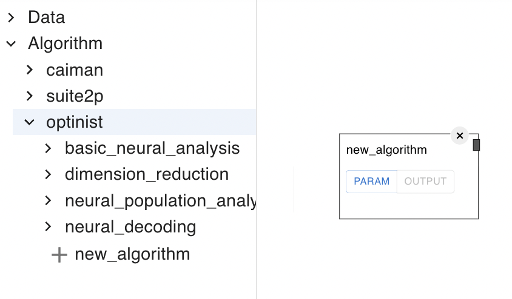
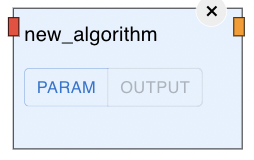
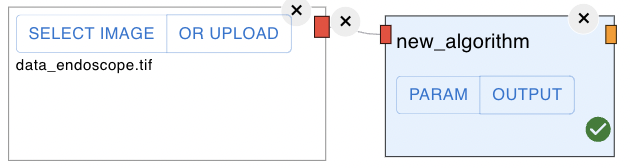
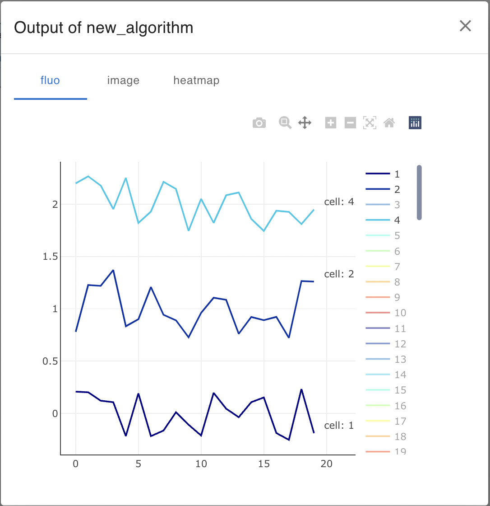

Add algorithm
=================

アルゴリズム追加方法

## 1. アルゴリズムファイルを作成
最初にpythonファイルを以下のdirectoryの適切な位置に作成する。
ここでは、例ととして`new_algorithm`という関数を作成する手順を説明する。作成する位置は、下のdirectory位置＊に作成する。

[algorithm list](https://github.com/oist/optinist/tree/develop/optinist/wrappers) 


- `__init__.py` - ①
- caiman_wrapper
    - `__init__.py` - ②
    - caiman_mc.py
    - caiman_cnmf.py
- suite2p_wrapper
    - `__init__.py`
    - suite2p_file_convert.py
    - suite2p_registration.py
    - suite2p_roi.py
    - suite2p_cnmf.py
- optinist_wrapper
    - `__init__.py`
    - basic neural analysis
    - dimension reduction
    - neural population analysis
    - neural decoding
    - `new_algorithm.py` - ＊


`new_algorith.py`を以下の位置に作成する。
https://github.com/oist/optinist/tree/main/optinist/wrappers/optinist_wrapper
new_algorithm.py
```python
def new_algorithm():
    return
```

<br />

## 2. algorithmの登録
①: 作成した`new_algorithm`関数をGUI上で使えるようにするには、各階層にある`__init__.py`に登録する必要がある。例えば①の`__init__.py`は以下のようになる。
これらは、一つ下の階層の`__init__.py`を読んでいる。
https://github.com/oist/optinist/blob/main/optinist/wrappers/__init__.py
```python
from .caiman_wrapper import caiman_wrapper_dict
from .suite2p_wrapper import suite2p_wrapper_dict
from .optinist_wrapper import optinist_wrapper_dict

wrapper_dict = {}
wrapper_dict.update(**caiman_wrapper_dict)
wrapper_dict.update(**suite2p_wrapper_dict)
wrapper_dict.update(**optinist_wrapper_dict)
```


②: `caiman_wrapper/__init__py`では具体的に関数が定義されており、次のように書かれている。`関数名: {'function': 関数名}`と書くことで関数として登録できる。
https://github.com/oist/optinist/blob/main/optinist/wrappers/caiman_wrapper/__init__.py
```python
from .motion_correction import caiman_mc
from .cnmf import caiman_cnmf

caiman_wrapper_dict = {
    'caiman': {
        'caiman_mc': { 
            'function': caiman_mc,
        },
        'caiman_cnmf': {
            'function': caiman_cnmf,
        },
    }
}

```


実際に`new_algorithm`関数を`optinist_wrapper/__init__.py`に定義する。
https://github.com/oist/optinist/blob/main/optinist/wrappers/optinist_wrapper/__init__.py
```python
from .basic_neural_analysis import basic_neural_analysis_wrapper_dict
from .dimension_reduction import dimension_reduction_wrapper_dict
from .neural_population_analysis import neural_population_analysis_wrapper_dict
from .neural_decoding import neural_decoding_wrapper_dict

# ↓↓new add↓↓
from .new_algorithm import new_algorithm
# ↑↑new add↑↑

optinist_wrapper_dict = {
    'optinist': {
        'basic_neural_analysis': basic_neural_analysis_wrapper_dict,
        'dimension_reduction': dimension_reduction_wrapper_dict ,
        'neural_population_analysis': neural_population_analysis_wrapper_dict,
        'neural_decoding': neural_decoding_wrapper_dict,
        # ↓↓new add↓↓
        'new_algorithm': {
            'function': new_algorithm
        }
        # ↑↑new add↑↑
    }
}
```


GUIを再起動し、TreeViewを確認すると、実際に`new_algorithm`が確認できる。
<p align="center">

</p>


## 3. 中身の記述
### 3.1 import
次にデータの入力、出力を定義する。
OptinistではいくつかのDataClassを定義することにより、InputとOutputの型の整合性をとっている。主なデータ型は以下の通りである。これらが、各Nodeのhandleの色に対応している。

Optinist support datatype.
- ImageData
- TimeSeriesData
- FluoData
- BehaviorData
- IscellData
- Suite2pData
- ScatterData
- BarData


### 3.2 Input & Output handle
例として、`new_algorithm`関数は`ImageData`を受け取り, `FluoData`を返す関数とする。
ここで、`from optinist.api.dataclass.dataclass import *`文はdataclassが定義されているファイルである。paramsはこの関数のパラメータが入るため、必要である。
```python:new_algorithm.py
from optinist.api.dataclass.dataclass import *

def new_algorithm(
        image_data: ImageData,
        params: dict=None
    ) -> dict(fluo=FluoData):
    return
```

GUIを再起動し、`new_algorithm`をおくと、handleの色が変更されていることが確認できる。
<p align="center">

</p>


### 3.3 出力結果の描画
- 上では、nodeのinputとoutputのhandleについて説明した、ここでは、結果の可視化について説明する。
- 関数の出力はdictionaryを指定する。`info`
- まず、`new_algorithm`関数の返り値となる`fluo`変数を`FluoData`でWrapして出力する。このときのkeyの名前は関数宣言時の`fluo`と一致させる必要がある。
- それ以外に、可視化したい変数については、そのデータ型でWrapし出力する。ここでは、`ImageData`と`HeatMap`を例にする。

```python:new_algorithm.py
def new_algorithm(
        image_data: ImageData,
        params: dict=None
    ) -> dict(fluo=FluoData):
    import numpy as np
    info = {
        "fluo": FluoData(np.random.rand(100, 20), file_name="fluo"),
        "image": ImageData(np.random.rand(10, 100, 100), file_name="image"),
        "heatmap": HeatMapData(np.random.rand(20, 20), file_name="heatmap")
    }
    return info
```

### 3.4 Snakemakeの登録
最後に関数を実行するためにSnakemakeファイルを記述する。
Snakemakeファイルは、関数と同じdirectory構造で以下のように記述されている。[snakemake list](https://github.com/oist/optinist/tree/develop/optinist/rules/smk) 

ここでは`new_algorithm.smk`というファイルを作成する。
中身は他のファイルをコピペし、`name`変数を`new_algorithm`にする。
具体的には下のようになるため、そのまま`optinist/rules/smk/optinist/new_algorithm.smk`に下のコードコピペする。
https://github.com/oist/optinist/tree/main/optinist/rules/smk/optinist

```python:optinist/rules/smk/optinist/new_algorithm.smk
from optinist.api.dir_path import DIRPATH
from optinist.api.snakemake.smk_dir import smk_input, smk_output

name = "new_algorithm"

rule:
    input:
        smk_input(config, name)
    output:
        smk_output(config, name)
    params:
        name = name
    script:
        f'{DIRPATH.ROOT_DIR}/rules/scripts/func.py'
```


GUIを再起動し、imageNodeを繋いで実行すると以下のように出力結果が表示される。

** 注意: 2 ~ 3秒で終わる処理なので、処理が終わらない場合にはエラーをしている可能性がある。console画面で赤文字のエラー部分を確認して頂きたい。エラーが解決できない場合には、slackやissueに貼って貰えると解決できる場合もある。
<p align="center">

</p>

<p align="center">

</p>
