Getting Started
=================

# Opening the browser
To start OptiNiSt, you need to open a console and activate optinist environment `conda activate optinist` and type `run_optinist` or, change to optinist directory `cd ~/optinist/` and run main script `python main.py`. 
The console shows the log once the startup is completed.

 

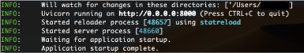

Once you see this, open your web browser (Google Chrome is recommended) at localhost:8000.
You are ready to start if the OptiNiSt page appears.

 

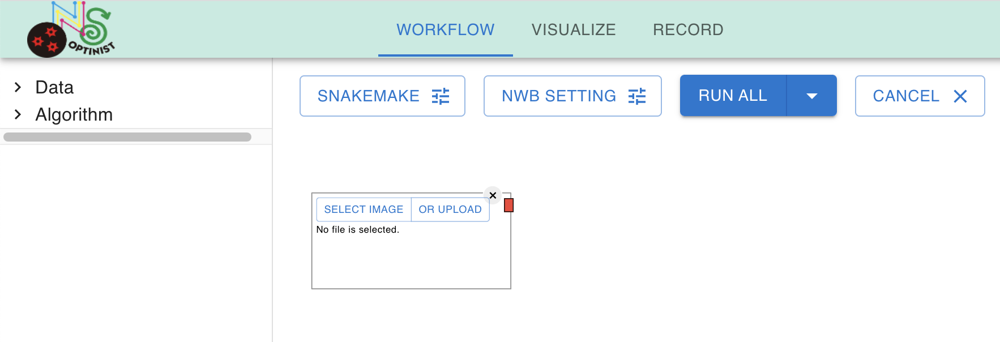

OptiNiSt has three different pages, WORKFLOW, VISUALIZE, and RECORD. You can toggle these by clicking on the tag. 
 

# Making Pipelines on WORKFLOW 
After launching, the first page you see is the workflow page. The workflow page is a place to define the analysis pipeline. You determine the data you will analyze, select the type of the algorithm or analysis method you use, and set the parameters and the order of analysis.  

### Assigning input data path
As a default, it shows an image node. This node defines the path to the data to use.  

 

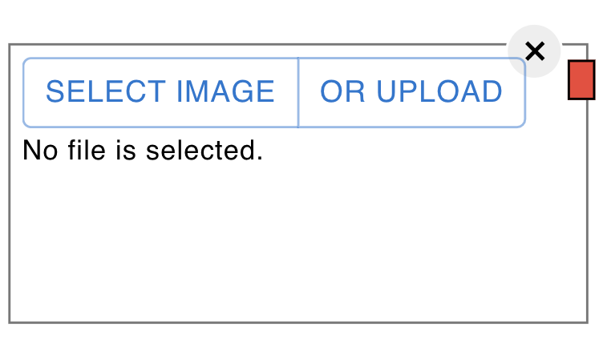

OptiNiSt uses OPTINIST_DIR for retrieving data and saving results. OptiNiSt searches input data from the OPTINIST_DIR/input directory. 

You may not want to change anything in your original data folder, or you may wish to make your data folder visible and accessible to OptiNist because the imaging data is sometimes huge and takes time to copy. You can take either strategy in assigning your data path.

1. Copy your original data file to OPTINIST_DIR and assign the data path to the copied data. See [uploading data to OPTNIST_DIR](#uploading-data-to-optinist_dir) This can be done from the GUI.  
2. Set OPTINIST_DIR as the data path by changing the dir_path.py file. See [setting optinist directory](#setting-optinist_dir).

Once the data is made accessible, the SELECT IMAGE button on the image node can assign the file as the input to the pipeline. You can select a file or a folder. Choosing a folder makes all the tiff files in the shown sequence an input set of continuous frames. See the case input file is [other than tiff] (../gui/workflow.md)/

### Selecting analysis methods
The left side of the window shows all available analysis methods. Clicking on the + mark adds the analysis nodes to the workflow field. ROI detection tools (currently suite2P and CaImAn ) are in ‘Algorithm’ category, and all other pre-installed analyses are in ‘optinist’ category.

 

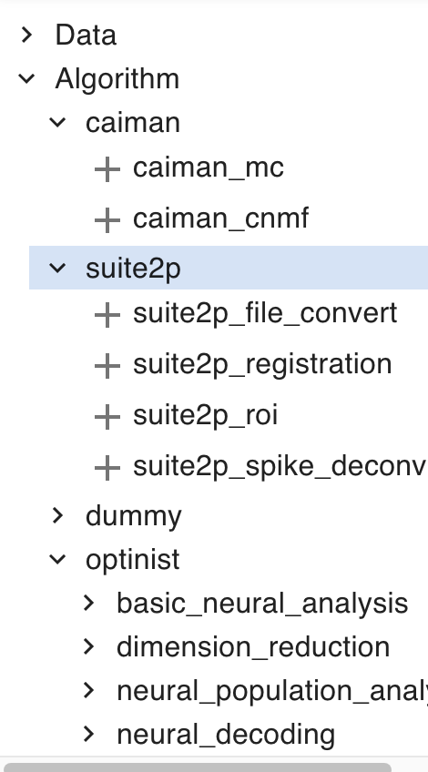

Let’s start with sample tiff data (mouse2p_2_long.tiff) and try suite2p ROI detection.
First, you need to determine the image you use. Select your image as explained [above](#assigning-input-data-path).
Once it is selected, it shows the name of files in the image node. 

 

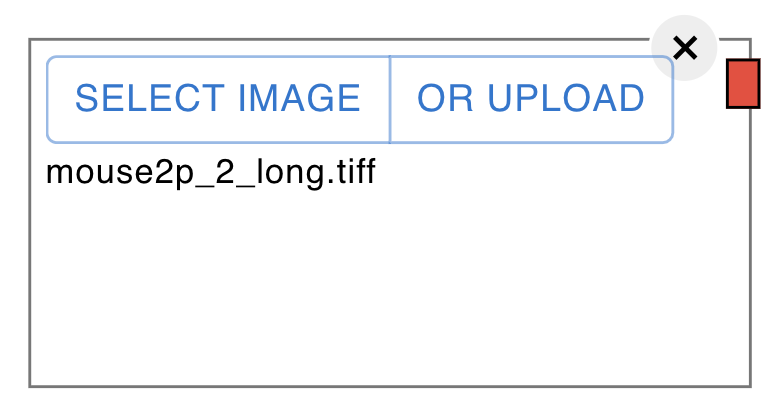

### creating pipelines

Then, connect the analysis nodes in the order you like to process. Drugging from an output connector to an input connector creates an edge. The color of the connector indicates the format. For example, red is the image type format. You can only connect the same color. (Exception: black is an undefined data format. You can connect the black connector with any other connector, but be careful it does not check the consistency of input and output).

 

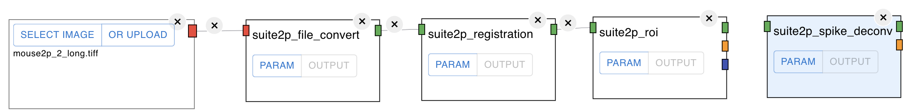

As for Suite2P, you might not use suite2P_registration (motion correction). In that case, you can connect the suite2p_file_convert to suite2p_roi directly. 

 

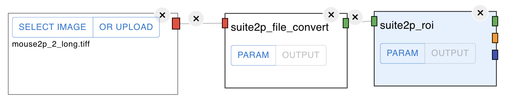

Also, you can perform motion correction of CaImAn (caiman_mc) and then perform suite2P_roi.

 

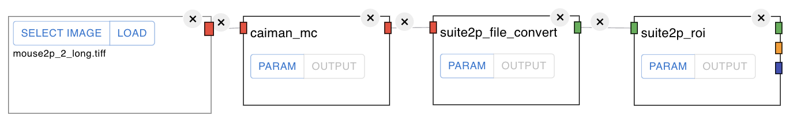

The nodes should be connected as long as the input and the output are of the same format type (same color).
Also, you can branch the flow. In the example, the two caiman_mc with different parameter settings are created, and the downstream from caiman_mc is also different. Each node's results are saved in a separate folder (See [RECORD](#record) part). 

 

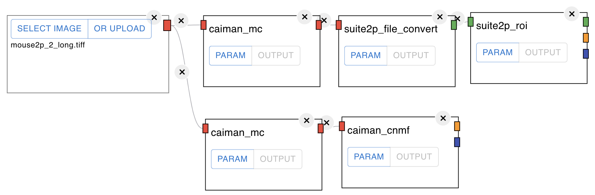

### parameter button and output button on the node
Each node has PARAM button and OUTPUT button. 

 

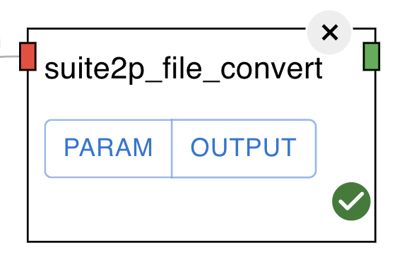

Clicking on PARAM shows the parameters. Edit this as you like. The names, types and the default values of the parameters are the same as the original algorithms. Refer to the original documentation to confirm the meaning of the parameters. Here is the [link list](LINK TO LINKLIST).

 

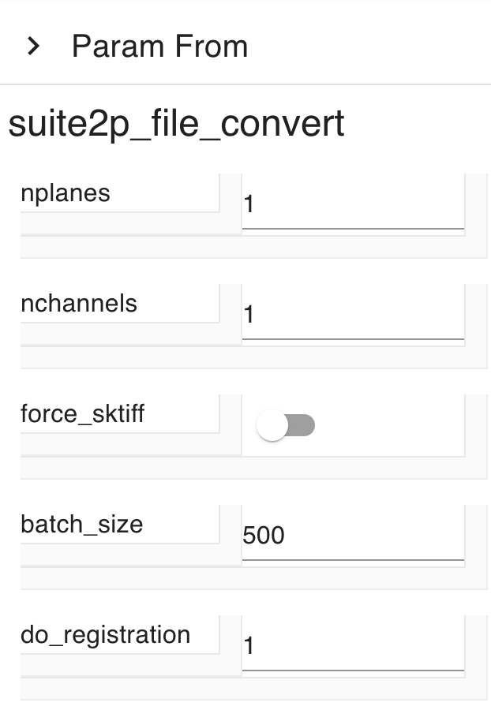

OUTPUT button is for the quick check of the result. The button becomes effective after the successful execution of the pipeline. [Here](#visualzing-images-and-plots) explains the details of the charts. 

### running pipelines

Now you are ready to run the pipeline.
RUN button at the right top shows two pulldown choices. RUNALL runs all the process. RUNALL assigns a new folder for saving the results. On the other hand, RUN skips the already ran processes. It checks the difference from the previous pipeline, including the existence of the results and the parameter change. If they are detected, the downstream process after that process is re-executed. The results are overwritten into the existing folder.

 

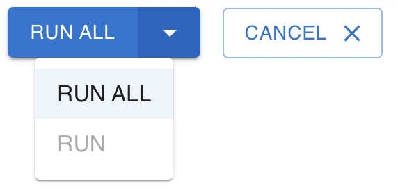

When you click on the RUNALL, it shows the window to determine the folder name. This folder name is only for the user’s convenience. The actual folder name is long digit random letter+number. Further information about the structure of the saved results is [here](LINKTO /docs/gui/record.md #setting-input-images).

Next to the RUN button, there is the CANCEL button. You can abort the running pipeline with this button. It immediately cancels the current execution.

 

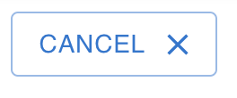

### time series analyses after ROI extraction
OptiNiSt offers some basic time series analysis functions. 

 

### Using behavioral parameters
In most cases, you have task-related variables and want to relate them to the cell's activity.

### SNAKEMANE and NWB SETTING

SNAKEMAKE and NWB SETTING buttons are for parameters for snakemake and output NWB file.
The pipeline construction of Optinist is based on snakemake (ref), which is the pipeline controlling tool for python scripts. The SNAKEMAKE parameter setting is [here](#snakemake-settings).

 

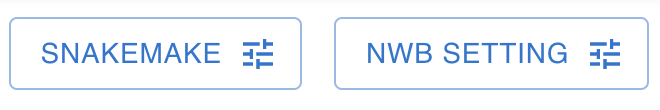

NWB SETTING defines the metadata for the NWB file as an output. The parameter you set here is only for your record and not used for the calculation inside OptiNiSt. You can leave this as default. The details of NWB setting in OptiNiSt is [here](#nwb-settings). Also, general info about NWB is [here](https://www.nwb.org/getting-started/)

### Additional information on WORKFLOW

##### uploading data to OPTNIST_DIR
Clicking on the UPLOAD button on the node opens the file explorer or finder so that you can select the data file. UPLOAD button copies the selected file to your OPTINIST_DIR/input. 

##### setting OPTINIST_DIR
The file assigning the OPTINIST_DIR is optinist/optinist/api/dir_path.py. Change line for OPTINIST_DIR, INPUT_DIR, and OUTPUT_DIR according to your demand. Changing dir_path.py may also be necessary when running the pipeline on your cluster computers.

##### snakemake settings
use_conda:  ADD COMMENTS!   
cores:  ADD COMMENTS!   
forceall:  ADD COMMENTS!   
forcetargets:  ADD COMMENTS!   
lock:  ADD COMMENTS! 

##### NWB settings
session_description: ADD COMMENTS! 
identifier: ADD COMMENTS! 
experiment_description: ADD COMMENTS! 
device: ADD COMMENTS! 
optical_channel: ADD COMMENTS! 
imaging_plane: ADD COMMENTS! 
image_serises: ADD COMMENTS! 
ophys: ADD COMMENTS! 

# Making the images and the plots on VISUALIZE
After executing the pipeline, you may want to check and compare the results.
VISUALIZE page is the place to work on this. You can replay the tiff time-series, see the cell ROI images, the plot of cell fluorescence or spike time-series, and other plots showing the results of analyses. See here (LINK TO THE visualize.md) for basic usage.

### Checking movies
You may want to check some frames of the multi-page tiff files. Visualize page offers the way to check. After creating a　plot box by clicking on + mark, Select the image using the SELECT IMAGE button on the left top.
You can select the range of the frame by assigning 1st and last frame numbers. LOAD button starts loading the data.

 

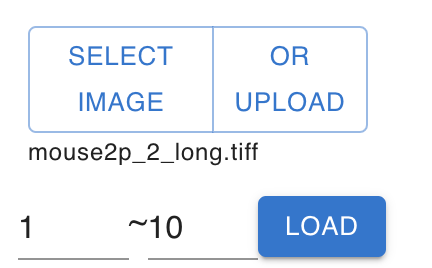

Click on the PLAY button within the plotting box to play the loaded movie.
The number indicated on the right of PAUSE button is the frame interval in milliseconds. 

 

### Showing ROI and time courses
After running the ROI detection algorithms, the most often created plots are extracted cells' shape and fluorescence time series. To show the plot, prepare two plotting boxes.

 

In one plotting box (ex, the one with ID:0), select a background image such as meanimg or Vcorr from the Select Item pulldowns.

 

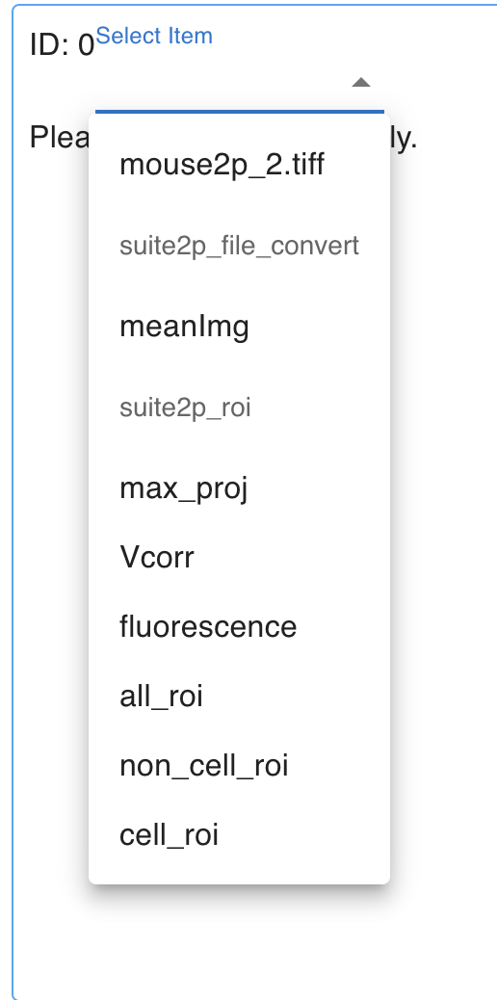

In the same plotting box, select cell_roi from the Select Roi pull-downs.

 

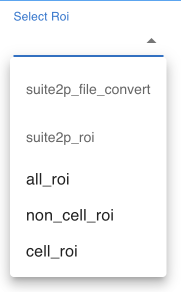

The plotting box (ID:0) shows the background image and detected cells.
 

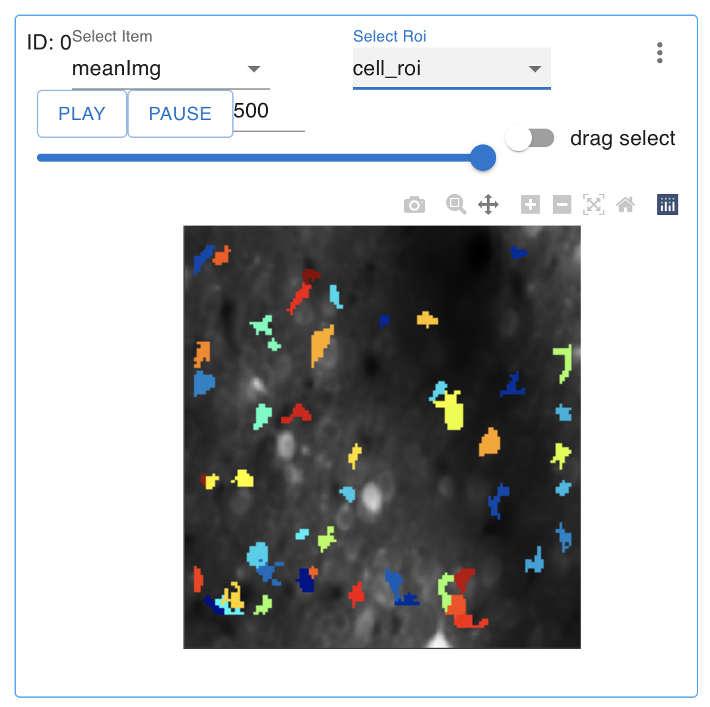

In another plotting box (ex, the one with ID:1), select fluorescence from the Select Item pulldown.
And select 0(same ID with the plotting box of your ROI image) from the ref image pull down. By doing this,  the two plotting boxes are linked. 

 

Now you can explore the ROI and time course. The color of ROI and corresponding time course is matched. You will know the cell ID by letting your mouse over the cell. Clicking on the cell automatically adds the fluorescence time course of the clicked cell. 
 

In the case it is tiring to select the cell by clicking one by one, Turn on teh drag select button on the right in the plotting box of ROI. It enables to select all the cells within rectangular area.
 

### Savind plots
You can save created plots in svg, png, jpeg, or webp format. Please select the format, decide the saving name in the lower area on the left panel, and click the camera mark in the plotting box. Svg format saves the plot as a vector-based graphical format which may be convenient when you need high-resolution figures.

 

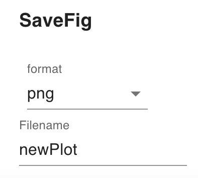

# managing records

RECORD section keeps your analysis pipeline easy to organize and easy to retrieve.

 

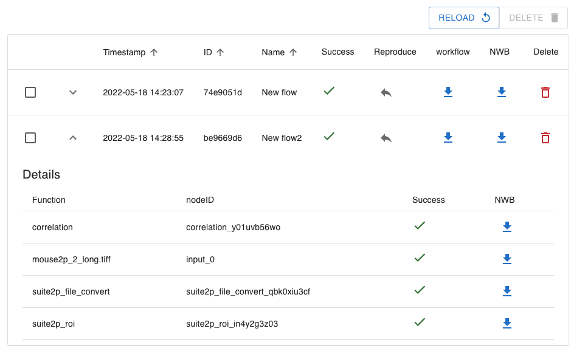

Clicking the Reproduce arrow retrieves the pipeline onto the workflow. This function is convenient when you re-start analysis after closing the browser. The reproduced pipeline needs to be RUN again (not ALL RUN) to make plots available.

 

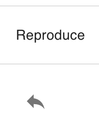

The Download buttons for the workflow column and the NWB column copy the snakemake config or NWB file to your download folder. The snakemake config file contains the workflow information and parameters for each node. The NWB file contains the data and its analysis results. This function is convenient when users share the same analysis pipeline or results.

 

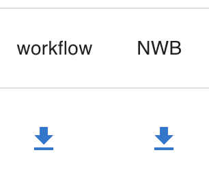

<!-- 
As a default, `OPTINIST_DIR` is assigned to /tmp/ in your computer.  
To specifically assign your OPTINIST_DIR in which OptiNiSt copies the data and saves the results,
type `export OPTINIST_DIR=~/your_dir` or change the line in optinist/api.dir_path.py directly

from
`_DEFAULT_DIR = '/tmp/optinist'`
to 
_DEFAULT_DIR = '/your_dir'`
-->

